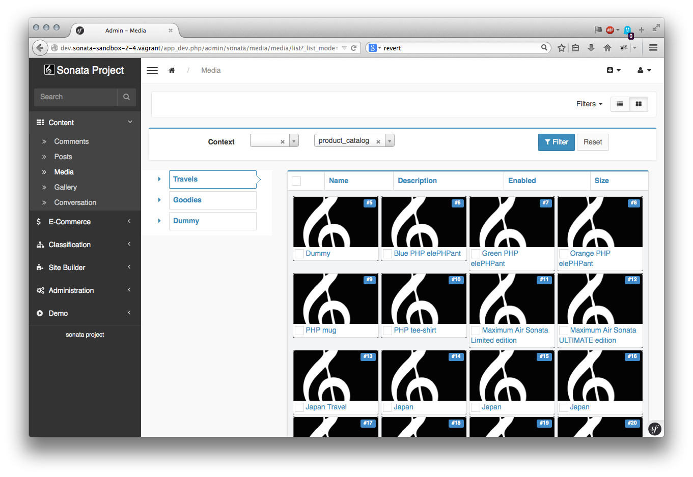

Customizing a mosaic list
=========================

Since version 3.0, the AdminBundle now include a mosaic list mode in order to have a more visual representation.

It is possible to configure the default view by creating a dedicated template.

First, configure the ``outer_list_rows_mosaic`` template key:

.. code-block:: xml

       <service id="sonata.media.admin.media" class="%sonata.media.admin.media.class%">
            <tag name="sonata.admin" manager_type="orm" group="sonata_media" label_catalogue="%sonata.media.admin.media.translation_domain%" label="media" label_translator_strategy="sonata.admin.label.strategy.underscore" />
            <argument />
            <argument>%sonata.media.admin.media.entity%</argument>
            <argument>%sonata.media.admin.media.controller%</argument>
            <call method="setTemplates">
                <argument type="collection">
                    <argument key="outer_list_rows_mosaic">SonataMediaBundle:MediaAdmin:list_outer_rows_mosaic.html.twig</argument>
                </argument>
            </call>

The ``list_outer_rows_mosaic.html.twig`` is the name of one mosaic's tile. You should also extends the template and overwrite the default blocks availables.

.. code-block:: jinja

    

    {{ meta.image }}

    
        {{ object.providerName|trans({}, 'SonataMediaBundle') }}
    

    
        {{ object.providerName|trans({}, 'SonataMediaBundle') }}

         {{ object.width }}x{{ object.height }}px
        
            ({{ object.length }})
        

         

        
           {{ object.authorname }}
        

        
            ~
        

        
            &copy; {{ object.copyright }}
        
    

    
        
            <a href="{{ admin.generateUrl('edit', {'id' : object|sonata_urlsafeid(admin) }) }}">{{ meta.title|truncate(40) }}</a>
        
            <a href="{{ admin.generateUrl('show', {'id' : object|sonata_urlsafeid(admin) }) }}">{{ meta.title|truncate(40) }}</a>
        
            {{ meta.title|truncate(40) }}
        
    

Block types:
 - ``sonata_mosaic_background``: this block is the background value defined in the ObjectMetadata object.
 - ``sonata_mosaic_default_view``: this block is used when the list is displayed.
 - ``sonata_mosaic_hover_view``: this block is used when the mouse is over the tile.
 - ``sonata_mosaic_description``: this block will be always on screen and should represent the entity's name.

The ``ObjectMetadata`` object is returned by the related admin class, for instance the MediaBundle defines the method as:

.. code-block:: jinja

    <?php

    class MediaAdmin extends AbstractAdmin
    {
        // [...] others methods

        public function getObjectMetadata($object)
        {
            $provider = $this->pool->getProvider($object->getProviderName());

            $url = $provider->generatePublicUrl($object, $provider->getFormatName($object, 'admin'));

            return new Metadata($object->getName(), $object->getDescription(), $url);
        }
    }

The final view will look like:

