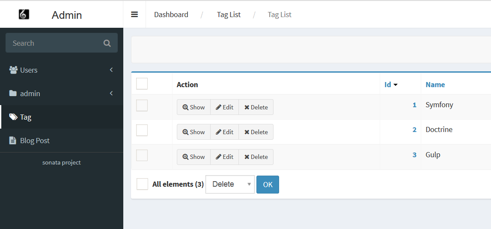

KnpMenu
=======

The admin comes with `KnpMenu`_ integration.
It integrates a menu with the KnpMenu library. This menu can be a SonataAdmin service, a menu created with a Knp menu provider or a route of a custom controller.

Add a custom controller entry in the menu
-----------------------------------------

To add a custom controller entry in the admin menu:

Create your controller:

.. code-block:: php

    class BlogController
    {
        /**
         * @Route("/blog", name="blog_home")
         */
        public function blogAction()
        {
            // ...
        }

        /**
         * @Route("/blog/article/{articleId}", name="blog_article")
         */
        public function ArticleAction($articleId)
        {
            // ...
        }
    }

Add the controller route as an item of the menu:

.. configuration-block::

    .. code-block:: yaml

        # app/config/config.yml

        sonata_admin:
            dashboard:
                groups:
                    news:
                        label:                ~
                        label_catalogue:      ~
                        items:
                            - sonata.news.admin.post
                            - route:        blog_home
                              label:        Blog
                            - route:        blog_article
                              route_params: { articleId: 3 }
                              label:        Article

If you want to show your route to user with different roles, you can configure this for each route. If this is not set,
group roles will be checked.

.. configuration-block::

    .. code-block:: yaml

        # app/config/config.yml

        sonata_admin:
            dashboard:
                groups:
                    news:
                        label:                ~
                        label_catalogue:      ~
                        items:
                            - sonata.news.admin.post
                            - route:        blog_home
                              label:        Blog
                              roles:        [ ROLE_FOO, ROLE_BAR ]
                            - route:        blog_article
                              route_params: { articleId: 3 }
                              label:        Article
                        roles: [ ROLE_ADMIN, ROLE_SONATA_ADMIN]

You can also override the template of knp_menu used by sonata. The default one is `SonataAdminBundle:Menu:sonata_menu.html.twig`:

.. configuration-block::

    .. code-block:: yaml

        # app/config/config.yml

        sonata_admin:
            templates:
                knp_menu_template:           ApplicationAdminBundle:Menu:custom_knp_menu.html.twig

And voilà, now you have a menu group which contains a link to a sonata admin via its id, to your blog and to a specific article.

Using a menu provider
---------------------

As seen above, the main way to declare your menu is by declaring items in your sonata admin config file. In some case you may have to create a more complex menu depending on your business logic. This is possible by using a menu provider to populate a whole menu group. This is done with the ``provider`` config value.

The following configuration uses a menu provider to populate the menu group ``my_group``:

.. configuration-block::

    .. code-block:: yaml

        # app/config/config.yml

        sonata_admin:
            dashboard:
                groups:
                    my_group:
                        provider:        'MyBundle:MyMenuProvider:getMyMenu'
                        icon:            '<i class="fa fa-edit"></i>'

With KnpMenuBundle you can create a custom menu by using a builder class or by declaring it as a service. Please see the `Knp documentation`_ for further information.

In sonata, whatever the implementation you choose, you only have to provide the menu alias to the provider config key:

* If you are using a builder class, your menu alias should be something like ``MyBundle:MyMenuProvider:getMyMenu``.
* If you are using a service, your menu alias is the alias set in the ``knp_menu.menu`` tag. In the following example this is ``my_menu_alias``:

.. configuration-block::

    .. code-block:: xml

        <service id="my_menu_provider" class="MyBundle/MyDirectory/MyMenuProvider">
            <tag name="knp_menu.menu" alias="my_menu_alias" />
        </service>

Please note that when using the provider option, you can't set the menu label via the configuration. It is done in your custom menu.

Extending the menu
------------------

You can modify the menu via events easily. You can register as many listeners as you want for the event with name ``sonata.admin.event.configure.menu.sidebar``:

.. code-block:: php

    <?php
    // src/AppBundle/EventListener/MenuBuilderListener.php

    namespace AppBundle\EventListener;

    use Sonata\AdminBundle\Event\ConfigureMenuEvent;

    class MenuBuilderListener
    {
        public function addMenuItems(ConfigureMenuEvent $event)
        {
            $menu = $event->getMenu();

            $child = $menu->addChild('reports', array(
                'route' => 'app_reports_index',
                'labelAttributes' => array('icon' => 'fa fa-bar-chart'),
            ));

            $child->setLabel('Daily and monthly reports');
        }
    }

.. configuration-block::

    .. code-block:: yaml

        # src/AppBundle/Resources/config/services.yml

        services:
            app.menu_listener:
                class: AppBundle\EventListener\MenuBuilderListener
                tags:
                    - { name: kernel.event_listener, event: sonata.admin.event.configure.menu.sidebar, method: addMenuItems }

Please see the `Using events to allow a menu to be extended`_ for further information.

Hiding menu items
-----------------

You can modify the menu to hide some menu items. You need to add the ``show_in_dashboard`` option in
your admin services or simply remove menu items from the ``sonata_admin`` dashboard group configuration:

.. code-block:: yaml

    sonata_admin.admin.post:
        class: Sonata\AdminBundle\Admin\PostAdmin
        arguments: [~, Sonata\AdminBundle\Entity\Post, SonataAdminBundle:CRUD]
        tags:
            - {name: sonata.admin, manager_type: orm, group: admin, label: Post, show_in_dashboard: false}

.. code-block:: yaml

    # app/config/config.yml

    sonata_admin:
        dashboard:
            groups:
                news:
                    label:                ~
                    label_catalogue:      ~
                    items:
                      # just comment or remove the sonata.news.admin.post declaration to hide it from the menu.
                      #  - sonata.news.admin.post
                        - route:        blog_home
                          label:        Blog
                        - sonata.news.admin.news

Show menu item without treeview
-------------------------------

You can modify the menu to show menu item without treeview. You need to add option ``on_top`` in your admin services
or in sonata_admin dashboard group configuration:

.. code-block:: yaml

    sonata_admin.admin.post:
        class: Sonata\AdminBundle\Admin\PostAdmin
        arguments: [~, Sonata\AdminBundle\Entity\Post, SonataAdminBundle:CRUD]
        tags:
            - {name: sonata.admin, manager_type: orm, group: admin, label: Post, on_top: true}

.. code-block:: yaml

    # app/config/config.yml

    sonata_admin:
        dashboard:
            groups:
                news:
                    on_top:               true
                    label:                ~
                    label_catalogue:      ~
                    items:
                        - sonata.news.admin.post

In this screenshot, we add ``on_top`` option to ``Tag`` and ``Blog Post`` admin services.

Your can't use this option for two or more items in the same time, for example:

.. code-block:: yaml

    # app/config/config.yml

    sonata_admin:
        dashboard:
            groups:
                news:
                    on_top:               true
                    label:                ~
                    label_catalogue:      ~
                    items:
                        - sonata.news.admin.post
                        - route:        blog_home
                          label:        Blog

In this case you have an exception: "You can't use ``on_top`` option with multiple same name groups".

.. _KnpMenu: https://github.com/KnpLabs/KnpMenu
.. _Knp documentation: http://symfony.com/doc/current/bundles/KnpMenuBundle/index.html#create-your-first-menu
.. _Using events to allow a menu to be extended: http://symfony.com/doc/master/bundles/KnpMenuBundle/events.html
