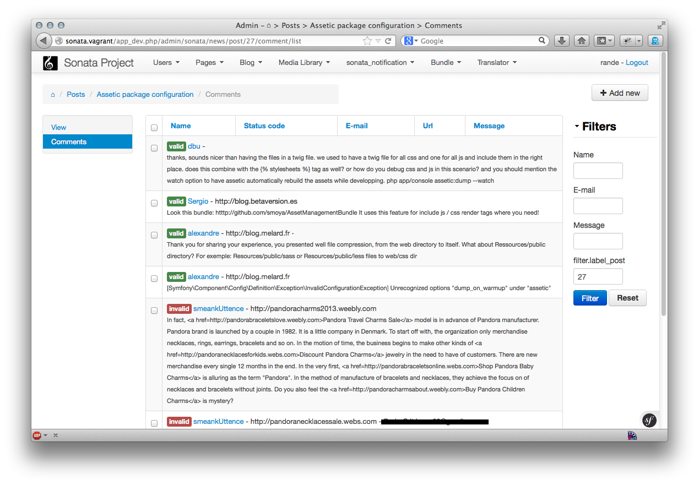

Row templates
=============

Since Sonata-2.2 it is possible to define a template per row for the list action.
The default template is a standard table but there are circumstances where this
type of layout might not be suitable. By defining a custom template for the row,
you can tweak the layout into something like this:

The recipe
----------

Configure your Admin service
^^^^^^^^^^^^^^^^^^^^^^^^^^^^

The configuration takes place in the DIC by calling the ``setTemplates`` method.
Two template keys need to be set:

- ``inner_list_row``: The template for the row, which you will customize. Often
  you will want this to extend ``SonataAdminBundle:CRUD:base_list_flat_inner_row.html.twig``
- ``base_list_field``: The base template for the cell, the default of
  ``SonataAdminBundle:CRUD:base_list_flat_field.html.twig`` is suitable for most
  cases but it can be customized if required.

.. configuration-block::

    .. code-block:: xml

        <service id="sonata.admin.comment" class="%sonata.admin.comment.class%">
            <tag name="sonata.admin" manager_type="orm" group="sonata_blog" label="comments"
                label_catalogue="%sonata.admin.comment.translation_domain%"
                label_translator_strategy="sonata.admin.label.strategy.underscore" />
            <argument />
            <argument>%sonata.admin.comment.entity%</argument>
            <argument>%sonata.admin.comment.controller%</argument>

            <call method="setTemplates">
                <argument type="collection">
                    <argument key="inner_list_row">
                        AppBundle:Admin:inner_row_comment.html.twig
                    </argument>
                    <argument key="base_list_field">
                        SonataAdminBundle:CRUD:base_list_flat_field.html.twig
                    </argument>
                </argument>
            </call>
        </service>

Create your customized template
^^^^^^^^^^^^^^^^^^^^^^^^^^^^^^^

Once the templates are defined, create the template to render the row:

.. code-block:: jinja

    {# AppBundle:Admin:inner_row_comment.html.twig #}

    {# Extend the default template, which provides batch and action cells #}
    {#     as well as the valid colspan computation #}
    

    

        {# you can use fields defined in the the Admin class #}

        {{ object|render_list_element(admin.list['name']) }} -
        {{ object|render_list_element(admin.list['url']) }} -
        {{ object|render_list_element(admin.list['email']) }}  

        <small>
            {# or you can use the object variable to render a property #}
            {{ object.message }}
        </small>

    

While this feature is nice to generate a rich list, it is also very easy to
break the layout and admin features such as batch and object actions. It is
best to familiarise yourself with the default templates and extend them where
possible, only changing what you need to customize.
