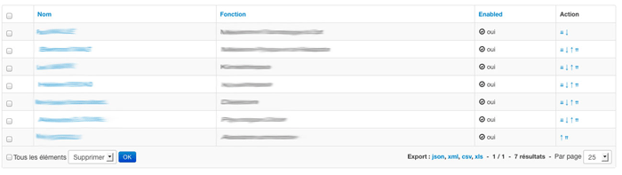

Sortable behavior in admin listing
==================================

This is a full working example of how to implement a sortable feature in your Sonata admin listing

Background
----------

`A sortable behavior <http://sonata-project.org/bundles/doctrine-orm-admin/master/doc/reference/form_field_definition.html#advanced-usage-one-to-many>`_ is already available for one-to-many relationships.
However there is no packaged solution to have some up and down arrows to sort
your records such as showed in the following screen.

Pre-requisites
--------------

- you already have SonataAdmin and DoctrineORM up and running
- you already have an Entity class for which you want to implement a sortable feature.
  For the purpose of the example we are going to call it ``Client``.
- you already have an Admin set up, in this example we will call it ``ClientAdmin``
- you already have gedmo/doctrine-extensions bundle in your project (check stof/doctrine-extensions-bundle
  or knplabs/doctrine-behaviors for easier integration in your project) with the sortable
  feature enabled
- you already have pixassociates/sortable-behavior-bundle bundle in your project

The recipe
----------

First of are going to add a position field in our ``Client`` entity.

.. code-block:: php

    /**
     * @Gedmo\SortablePosition
     * @ORM\Column(name="position", type="integer")
     */
    private $position;

In ``ClientAdmin`` our we are going to add in the ``configureListFields`` method
a custom action and use the default twig template provided in the PixSortableBehaviorBundle

.. code-block:: php

	$listMapper
	->add('_action', 'actions', array(
                'actions' => array(
                    'move' => array('template' => 'PixSortableBehaviorBundle:Default:_sort.html.twig'),
                )
            ));

In order to add new routes for these actions we are also adding the following method

.. code-block:: php

	protected function configureRoutes(RouteCollection $collection)
	{
	    $collection->add('move', $this->getRouterIdParameter() . '/move/{position}');
	}

Now you can update your ``admin.yml`` to use the handler provider by the PixSortableBehaviorBundle

.. code-block:: yaml

	services:
	    acme.admin.client:
	        class: Acme\DemoBundle\Admin\ClientAdmin
	        tags:
	            - { name: sonata.admin, manager_type: orm, label: "Clients" }
	        arguments:
	            - ~
	            - Acme\DemoBundle\Entity\Client
	            - 'PixSortableBehaviorBundle:SortableAdmin' # define the new controller via the third argument
	        calls:
	            - [ setTranslationDomain, [AcmeDemoBundle]]

Last tricky part, in order to get the last position available in our twig template
we inject the service container in our admin class, define a public variable ``$last_position``
and retrieve the value from our service in the ``configureListFields`` method. We
also define the sort by field to be position

.. code-block:: php

   class ClientAdmin extends Admin
   {

    public $last_position = 0;

    private $container;
    private $positionService;

    public function setContainer(\Symfony\Component\DependencyInjection\ContainerInterface $container)
    {
        $this->container = $container;
    }

    public function setPositionService(\Pix\SortableBehaviorBundle\Services\PositionHandler $positionHandler)
    {
        $this->positionService = $positionHandler;
    }
    
    protected $datagridValues = array(
        '_page' => 1,
        '_sort_order' => 'ASC',
        '_sort_by' => 'position',
    );

    protected function configureListFields(ListMapper $listMapper)
    {
        $this->last_position = $this->positionService->getLastPosition($this->getRoot()->getClass());
        $listMapper
            ->addIdentifier('name')
            ->add('enabled')
            ->add('_action', 'actions', array(
                'actions' => array(
                    'move' => array('template' => 'AcmeDemoBundle:Admin:_sort.html.twig'),
                )
            ));
    }

And in  the admin.yml add the following call

.. code-block:: yaml
    
	- [ setContainer, [ @service_container ] ]
	- [ setPositionService, [@pix_sortable_behavior.position]]

You should now have in your listing a new action column with 4 arrows to sort your records.

Enjoy ;)

Further work
------------

* handle ajax request
* interface for SonataAdminBundle
