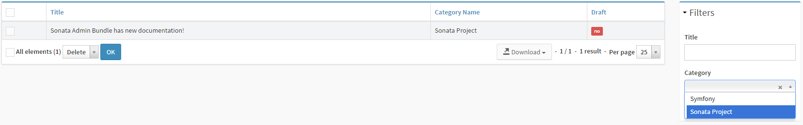

The List View
=============

You've given the admin a nice interface to create and edit blog posts and
categories. But there is not much to change if the admin doesn't have a list of
all available blog posts. Because of this, this chapter will teach you more
about the list view.

If you have created some posts and go to
http://localhost:8000/admin/app/blogpost/list, you'll see an empty list page.
That's not because there is no content, but because you didn't configure your
Admin's list view. As Sonata doesn't know which fields to show, it just shows
empty rows.

Configuring the List Mapper
---------------------------

Fixing the above problem is easy: Just add the fields you want to show on the
list page to the list view:

.. code-block:: php

    // src/AppBundle/Admin/BlogPostAdmin.php
    namespace AppBundle\Admin;

    // ...
    class BlogPostAdmin extends Admin
    {
        // ...

        protected function configureListFields(ListMapper $listMapper)
        {
            $listMapper
                ->add('title')
                ->add('draft')
            ;
        }
    }

Going to the list view of the blog post admin again, you'll see the available
blog posts:

.. image:: ../images/getting_started_basic_list_view.png

You can see that Sonata already guesses a correct field type and makes sure it
shows it in a friendly way. The boolean draft field for instance is show as a
red "no" block, indicating ``false``.

Cool! But... how can an admin go from this page to the edit page for a blog post?
There seem to be nothing that looks like a link. That's correct, you need to
tell Sonata which field(s) you want to use as a link.

Defining the Identifier Field(s)
~~~~~~~~~~~~~~~~~~~~~~~~~~~~~~~~

The fields which contain a link to the edit pages are called identifier fields.
It makes sense to make the title field link to the edit page, so you can add it
as an identifier field. This is done by using ``ListMapper#addIdentifier()``
instead of ``ListMapper#add()``:

.. code-block:: php

    // src/AppBundle/Admin/BlogPostAdmin.php
    namespace AppBundle\Admin;

    // ...
    class BlogPostAdmin extends Admin
    {
        // ...

        protected function configureListFields(ListMapper $listMapper)
        {
            $listMapper
                ->addIdentifier('title')
                ->add('draft')
            ;
        }
    }

When saving this, you can now see that the title field has the link you were
looking for.

Displaying Other Models
~~~~~~~~~~~~~~~~~~~~~~~

Now you probably also want the Category to be included in the list. To do that,
you need to reference it. You can't add the ``category`` field to the list
mapper, as it will then try to show the entity as a string. As you've learned
in the previous chapter, adding ``__toString`` to the entity is not recommended
as well.

Fortunately, there is an easy way to reference other models by using the dot
notation. Using this notation, you can specify which fields you want to show.
For instance, ``category.name`` will show the ``name`` property of the
category.

.. code-block:: php

    // src/AppBundle/Admin/BlogPostAdmin.php
    namespace AppBundle\Admin;

    // ...
    class BlogPostAdmin extends Admin
    {
        // ...

        protected function configureListFields(ListMapper $listMapper)
        {
            $listMapper
                ->addIdentifier('title')
                ->add('category.name')
                ->add('draft')
            ;
        }
    }

Adding Filter/Search Options
----------------------------

Assume you had a very succesfull blog site containing many blog posts. After a
while, finding the blog post you wanted to edit would be like finding a needle
in a haystack. As with all user experience problems, Sonata provides a solution
for it!

It does this by allowing you to configure datagrid filters in the
``Admin#configureDatagridFilters()`` method. For instance, to allow the admin
to search blog posts by title (and also order them by alfabet in the list), you
would do something like:

.. code-block:: php

    // src/AppBundle/Admin/BlogPostAdmin.php
    namespace AppBundle\Admin;

    use Sonata\AdminBundle\Datagrid\DatagridMapper;

    // ...
    class BlogPostAdmin extends Admin
    {
        protected function configureDatagridFilters(DatagridMapper $datagridMapper)
        {
            $datagridMapper->add('title');
        }
    }

This will add a little block to the left of the block showing a search input
for the title field.

Filtering by Category
~~~~~~~~~~~~~~~~~~~~~

Filtering by another model's properties is a little bit more difficult. The add
field has 5 arguments:

.. code-block:: php

    public function add(
        $name,

        // filter
        $type = null,
        array $filterOptions = array(),

        // field
        $fieldType = null,
        $fieldOptions = null
    )

As you can see, you can both customize the type used to filter and the type
used to display the search field. You can rely on the type guessing mechanism
of Sonata to pick the correct field types. However, you still need to configure
the search field to use the ``name`` property of the Category:

.. code-block:: php

    // src/AppBundle/Admin/BlogPostAdmin.php
    namespace AppBundle\Admin;

    use Sonata\AdminBundle\Datagrid\DatagridMapper;

    // ...
    class BlogPostAdmin extends Admin
    {
        protected function configureDatagridFilters(DatagridMapper $datagridMapper)
        {
            $datagridMapper
                ->add('title')
                ->add('category', null, array(), 'entity', array(
                    'class'    => 'AppBundle\Entity\Category',
                    'property' => 'name',
                ))
            ;
        }
    }

With this code, a dropdown will be shown including all available categories.
This will make it easy to filter by category.

Round Up
--------

This time, you've learned how to make it easy to find posts to edit. You've
learned how to create a nice list view and how to add options to search, order
and filter this list.

There might have been some very difficult things, but imagine the difficulty
writing everything yourself! As you're now already quite good with the basics,
you can start reading other articles in the documentation, like:

* :doc:`Customizing the Dashboard <../reference/dashboard>`
* :doc:`Configuring the Security system <../reference/security>`
* :doc:`Adding export functionality <../reference/action_export>`
* :doc:`Adding a preview page <../reference/preview_mode>`
