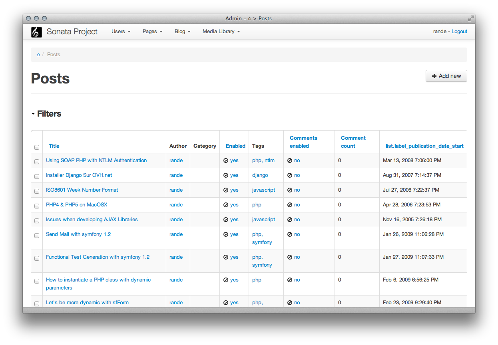
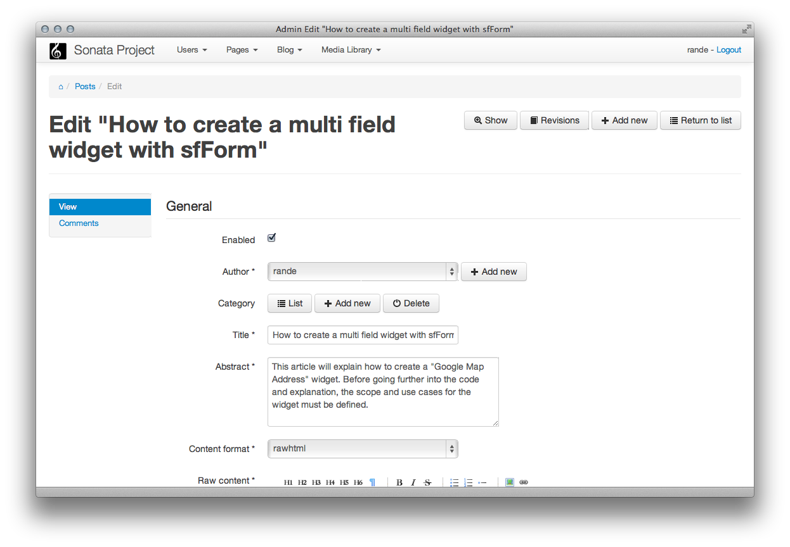
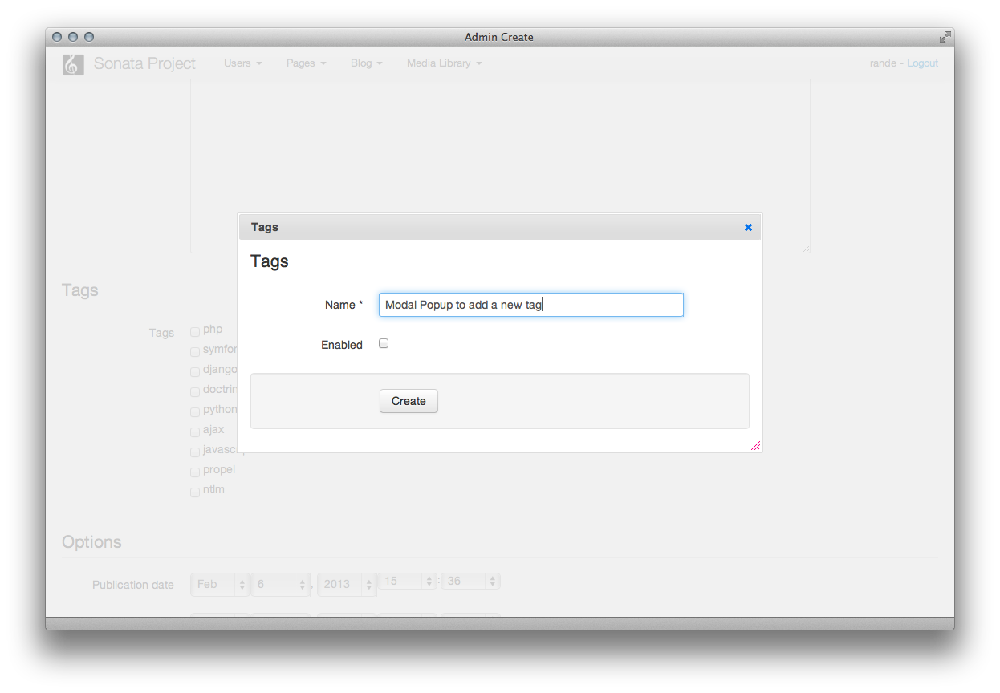

Admin Bundle
============

**SonataAdminBundle is split into 5 bundles:**

* SonataAdminBundle: contains core libraries and services
* `SonataDoctrineORMAdminBundle <https://github.com/sonata-project/SonataDoctrineORMAdminBundle>`_: integrates Doctrine ORM project with the core admin bundle
* `SonataDoctrineMongoDBAdminBundle <https://github.com/sonata-project/SonataDoctrineMongoDBAdminBundle>`_: integrates MongoDB with the core admin bundle (early stage)
* `SonataDoctrinePhpcrAdminBundle <https://github.com/sonata-project/SonataDoctrinePhpcrAdminBundle>`_: integrates PHPCR with the core admin bundle (early stage)
* `SonataPropelAdminBundle <https://github.com/sonata-project/SonataPropelAdminBundle>`_: integrates Propel with the core admin bundle (early stage)

The demo website can be found in http://demo.sonata-project.org/admin/dashboard (admin as user and password).

Reference Guide
---------------

.. toctree::
   :maxdepth: 1
   :numbered:

   reference/installation
   reference/getting_started
   reference/configuration
   reference/architecture
   reference/dashboard
   reference/routing
   reference/action_list
   reference/action_create_edit
   reference/action_show
   reference/action_delete
   reference/action_export
   reference/saving_hooks
   reference/form_types
   reference/form_help_message
   reference/field_types
   reference/conditional_validation
   reference/templates
   reference/batch_actions
   reference/translation
   reference/security
   reference/extensions
   reference/advance
   reference/console
   reference/preview_mode
   reference/troubleshooting
   reference/recipe_file_uploads
   reference/recipe_image_previews
   reference/recipe_row_templates

Overview
--------

.. figure:: ./images/dashboard.png
   :align: center
   :alt: The dashboard
   :width: 700px

   The dashboard

   The model list

   The model edition

   The modal model edition

.. figure:: ./images/acl_editor.png
   :align: center
   :alt: The ACL editor
   :width: 700px