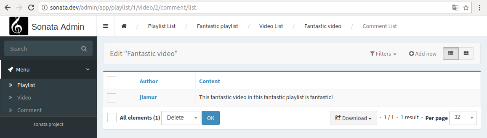

Create child admins
-------------------

Let us say you have a ``PlaylistAdmin`` and a ``VideoAdmin``. You can optionally declare the ``VideoAdmin``
to be a child of the ``PlaylistAdmin``. This will create new routes like, for example, ``/playlist/{id}/video/list``,
where the videos will automatically be filtered by post.

To do this, you first need to call the ``addChild`` method in your ``PlaylistAdmin`` service configuration:

.. configuration-block::

    .. code-block:: xml

        <!-- app/config/config.xml -->
        <service id="sonata.admin.playlist" class="AppBundle\Admin\PlaylistAdmin">
            <!-- ... -->

            <call method="addChild">
                <argument type="service" id="sonata.admin.video" />
            </call>
        </service>

Then, you have to set the VideoAdmin ``parentAssociationMapping`` attribute to ``playlist`` :

.. code-block:: php

    <?php

    namespace AppBundle\Admin;

    // ...

    class VideoAdmin extends AbstractAdmin
    {
        protected $parentAssociationMapping = 'playlist';

        // OR

        public function getParentAssociationMapping()
        {
            return 'playlist';
        }
    }

To display the ``VideoAdmin`` extend the menu in your ``PlaylistAdmin`` class:

.. code-block:: php

    <?php

    namespace AppBundle\Admin;

    use Knp\Menu\ItemInterface as MenuItemInterface;
    use Sonata\AdminBundle\Admin\AbstractAdmin;
    use Sonata\AdminBundle\Admin\AdminInterface;

    class PlaylistAdmin extends AbstractAdmin
    {
        // ...

        protected function configureSideMenu(MenuItemInterface $menu, $action, AdminInterface $childAdmin = null)
        {
            if (!$childAdmin && !in_array($action, array('edit', 'show'))) {
                return;
            }

            $admin = $this->isChild() ? $this->getParent() : $this;
            $id = $admin->getRequest()->get('id');

            $menu->addChild('View Playlist', array('uri' => $admin->generateUrl('show', array('id' => $id))));

            if ($this->isGranted('EDIT')) {
                $menu->addChild('Edit Playlist', array('uri' => $admin->generateUrl('edit', array('id' => $id))));
            }

            if ($this->isGranted('LIST')) {
                $menu->addChild('Manage Videos', array(
                    'uri' => $admin->generateUrl('sonata.admin.video.list', array('id' => $id))
                ));
            }
        }
    }

It also possible to set a dot-separated value, like ``post.author``, if your parent and child admins are not directly related.

Be wary that being a child admin is optional, which means that regular routes
will be created regardless of whether you actually need them or not. To get rid
of them, you may override the ``configureRoutes`` method::

    <?php

    namespace AppBundle\Admin;

    use Sonata\AdminBundle\Admin\AbstractAdmin;
    use Sonata\AdminBundle\Route\RouteCollection;

    class VideoAdmin extends AbstractAdmin
    {
        protected $parentAssociationMapping = 'playlist';

        protected function configureRoutes(RouteCollection $collection)
        {
            if ($this->isChild()) {

                // This is the route configuration as a child
                $collection->clearExcept(['show', 'edit']);

                return;
            }

            // This is the route configuration as a parent
            $collection->clear();

        }
    }

You can nest admins as deep as you wish.

Let's say you want to add comments to videos.

You can then add your ``CommentAdmin`` admin service as a child of
the ``VideoAdmin`` admin service.

Finally, the admin interface will look like this:

