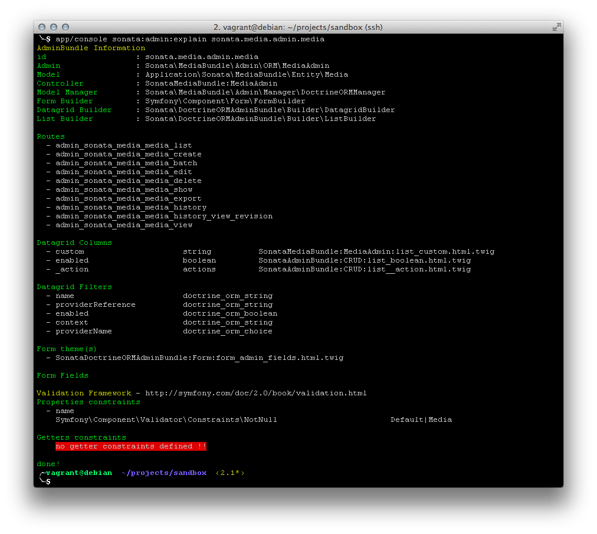
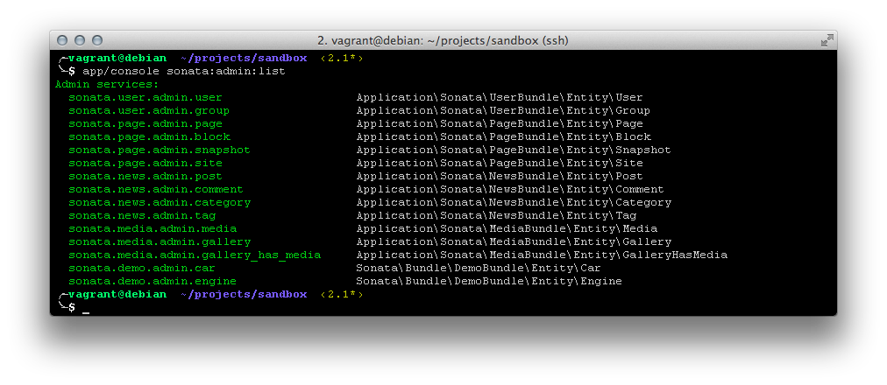

Console/Command-Line Commands
=============================

SonataAdminBundle provides the following console commands:

* ``cache:create-cache-class``
* ``sonata:admin:explain``
* ``sonata:admin:list``
* ``sonata:admin:setup-acl``

cache:create-cache-class
------------------------

The ``cache:create-cache-class`` command generates the cache class
(``app/cache/...env.../classes.php``) from the classes.map file.

Usage example:

.. code-block:: bash

    php app/console cache:create-cache-class

sonata:admin:explain
--------------------

The ``sonata:admin:explain`` command prints details about the admin of a model.
As an argument you need to specify admin service id of the model you need
explaining.

Usage example:

.. code-block:: bash

    php app/console sonata:admin:explain sonata.news.admin.post

   Explain command

sonata:admin:list
-----------------

If you wish to see which admin services are available, you can use
``sonata:admin:list`` command. It prints all the admin service ids available in
your application. Command gets ids from ``sonata.admin.pool`` service where all
the available admin services are present.

Usage example:

.. code-block:: bash

    php app/console sonata:admin:list

   List command

sonata:admin:setup-acl
----------------------

The ``sonata:admin:setup-acl`` command updates ACL definitions for all admin
classes available in ``sonata.admin.pool``. For instance every time you create a
new ``Admin`` class, you can create ACL by using the ``sonata:admin:setup-acl``
command. The ACL database will be automatically updated with the latest masks
and roles informations.

Usage example:

.. code-block:: bash

    php app/console sonata:admin:setup-acl
