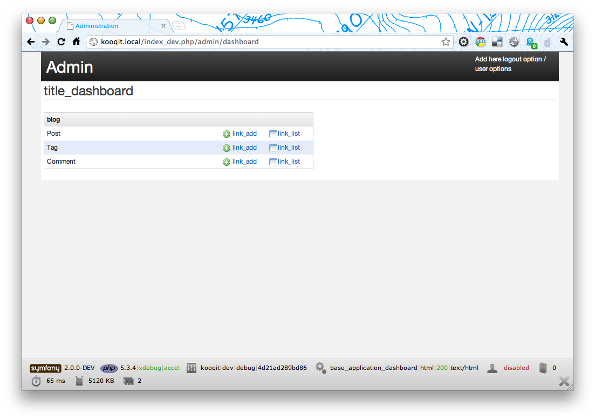

Dashboard
=========

The Dashboard is the main landing page. By default it lists your mapped models,
as defined by your ``Admin`` services. This is useful to help you start using
``SonataAdminBundle`` right away, but there is much more that you can do to take
advantage of the Dashboard.

The Dashboard is, by default, available at ``/admin/dashboard``, which is handled by
the ``SonataAdminBundle:Core:dashboard`` controller action. The default view file for
this action is ``SonataAdminBundle:Core:dashboard.html.twig``, but you can change
this in your ``config.yml``:

.. configuration-block::

    .. code-block:: yaml

        # app/config/config.yml

        sonata_admin:
            templates:
                dashboard: SonataAdminBundle:Core:dashboard.html.twig

.. note::

    This view, like most of the ``SonataAdminBundle`` views, extends a global
    template file, which also contains significant parts to the page. More information
    about this is available in the :doc:`templates` chapter.

Blocks
------

The Dashboard is actually built using ``Blocks`` from ``SonataBlockBundle``. You
can learn more about this bundle and how to build your own Blocks on the
`SonataBlock documentation page`_.

The ``Admin`` list block
------------------------

The ``Admin`` list is a ``Block`` that fetches information from the ``Admin`` service's
``Pool`` and prints it in the nicely formatted list you have on your default Dashboard.
The ``Admin`` list is defined by the ``sonata.admin.block.admin_list`` service, which is
implemented by the ``Block\AdminListBlockService`` class. It is then rendered using the
``SonataAdminBundle:Block:block_admin_list.html.twig`` template file.

Feel free to take a look at these files. You'll find the code rather short and easy to
understand, and it will be a great help when implementing your own blocks.

Configuring the ``Admin`` list
------------------------------

As you probably noticed by now, the ``Admin`` list groups ``Admin`` mappings together.
There are several ways in which you can configure these groups.

By default the admins are ordered the way you defined them. With the setting ``sort_admins``
groups and admins will be ordered by their respective label with a fallback to the admin id.

Using the ``Admin`` service declaration
^^^^^^^^^^^^^^^^^^^^^^^^^^^^^^^^^^^^^^^

The first, and most commonly used, method is to set a group when defining your ``Admin``
services:

.. configuration-block::

    .. code-block:: xml

        <service id="app.admin.post" class="AppBundle\Admin\PostAdmin">
              <tag name="sonata.admin" manager_type="orm"
                  group="Content"
                  label="Post" />
              <argument />
              <argument>AppBundle\Entity\Post</argument>
              <argument />
          </service>

    .. code-block:: yaml

        services:
            app.admin.post:
                class: AppBundle\Admin\PostAdmin
                tags:
                    - name: sonata.admin
                      manager_type: orm
                      group: "Content"
                      label: "Post"
                arguments:
                    - ~
                    - AppBundle\Entity\Post
                    - ~
                public: true

In these examples, notice the ``group`` tag, stating that this particular ``Admin``
service belongs to the ``Content`` group.

.. configuration-block::

    .. code-block:: xml

        <service id="app.admin.post" class="AppBundle\Admin\PostAdmin">
              <tag name="sonata.admin" manager_type="orm"
                  group="app.admin.group.content"
                  label="app.admin.model.post" label_catalogue="AppBundle" />
              <argument />
              <argument>AppBundle\Entity\Post</argument>
              <argument />
          </service>

    .. code-block:: yaml

        services:
            app.admin.post:
                class: AppBundle\Admin\PostAdmin
                tags:
                    - name: sonata.admin
                      manager_type: orm
                      group: "app.admin.group.content"
                      label: "app.admin.model.post"
                      label_catalogue: "AppBundle"
                arguments:
                    - ~
                    - AppBundle\Entity\Post
                    - ~

In this example, the labels are translated by ``AppBundle``, using the given
``label_catalogue``. So, you can use the above examples to support multiple languages
in your project.

.. note::

    You can use parameters (e.g. ``%app_admin.group_post%``) for the group names
    in either scenario.

Using the ``config.yml``
^^^^^^^^^^^^^^^^^^^^^^^^

You can also configure the ``Admin`` list in your ``config.yml`` file. This
configuration method overrides any settings defined in the Admin service
declarations.

.. configuration-block::

    .. code-block:: yaml

        # app/config/config.yml

        sonata_admin:
            dashboard:
                groups:
                    app.admin.group.content:
                        label: app.admin.group.content
                        label_catalogue: AppBundle
                        items:
                            - app.admin.post

                    app.admin.group.blog:
                        items: ~
                        item_adds:
                            - sonata.admin.page
                        roles: [ ROLE_ONE, ROLE_TWO ]

                    app.admin.group.misc: ~

.. note::

    This is an academic, full configuration, example. In real cases, you will usually
    not need to use all the displayed options. To use a default value for any setting
    either leave out that key or use the ``~`` value for that option.

This configuration specifies that the ``app.admin.group.content`` group uses the
``app.admin.group.content`` label, which is translated using the ``AppBundle``
translation catalogue (the same label and translation configuration that we declared
previously, in the service definition example).

It also states that the ``app.admin.group.content`` group contains just the
``app.admin.post`` ``Admin`` mapping, meaning that any other ``Admin`` services
declared as belonging to this group will not be displayed here.

Secondly, we declare a ``app.admin.group.blog`` group as having all its default items
(i.e. the ones specified in the ``Admin`` service declarations), plus an *additional*
``sonata.admin.page`` mapping, that was not initially part of this group.

We also use the ``roles`` option here, which means that only users with the ``ROLE_ONE``
or ``ROLE_TWO`` privileges will be able to see this group, as opposed to the default setting
which allows everyone to see a given group. Users with ``ROLE_SUPER_ADMIN`` are always
able to see groups that would otherwise be hidden by this configuration option.

The third group, ``app.admin.group.misc``, is set up as a group which uses all its
default values, as declared in the service declarations.

Adding more Blocks
------------------

Like we said before, the Dashboard comes with a default ``Admin`` list block, but
you can create and add more blocks to it.

In this screenshot, in addition to the default ``Admin`` list block on the left, we added
a text block and RSS feed block on the right. The configuration for this scenario would be:

.. configuration-block::

    .. code-block:: yaml

        # app/config/config.yml

        sonata_admin:
            dashboard:
                blocks:
                    -
                        position: left
                        type: sonata.admin.block.admin_list
                    -
                        position: right
                        type: sonata.block.service.text
                        settings:
                            content: >
                                <h2>Welcome to the Sonata Admin</h2>
                                
This is a <code>sonata.block.service.text</code> from the Block
                                Bundle, you can create and add new block in these area by configuring
                                the <code>sonata_admin</code> section.
   For instance, here
                                a RSS feed parser (<code>sonata.block.service.rss</code>):
                    -
                        position: right
                        type: sonata.block.service.rss
                        roles: [POST_READER]
                        settings:
                            title: Sonata Project's Feeds
                            url: https://sonata-project.org/blog/archive.rss

.. note::

    Blocks may accept/require additional settings to be passed in order to
    work properly. Refer to the associated documentation/implementation to
    get more information on each block's options and requirements.

    You can also configure the ``roles`` section to configure users that can
    view the block.

Display two ``Admin`` list blocks with different dashboard groups
^^^^^^^^^^^^^^^^^^^^^^^^^^^^^^^^^^^^^^^^^^^^^^^^^^^^^^^^^^^^^^^^^

The same block can have multiple instances, and be displayed multiple times
across the Dashboard using different configuration settings for each instance.
A particular example is the ``Admin`` list block, which can be configured to
suit this scenario.

.. configuration-block::

    .. code-block:: yaml

        # app/config/config.yml

        sonata_admin:
            dashboard:
                blocks:

                    # display two dashboard blocks
                    -
                        position: left
                        type: sonata.admin.block.admin_list
                        settings:
                            groups: [sonata_page1, sonata_page2]
                    -
                        position: right
                        type: sonata.admin.block.admin_list
                        settings:
                            groups: [sonata_page3]

                groups:
                    sonata_page1:
                        items:
                            - sonata.page.admin.myitem1

                    sonata_page2:
                        items:
                            - sonata.page.admin.myitem2
                            - sonata.page.admin.myitem3

                    sonata_page3:
                        items:
                            - sonata.page.admin.myitem4

In this example, you would have two ``admin_list`` blocks on your dashboard, each
of them containing just the respectively configured groups.

.. _`SonataBlock documentation page`:  https://sonata-project.org/bundles/block/master/doc/index.html

Statistic Block
~~~~~~~~~~~~~~~

A statistic block can be used to display a simple counter with a color, an font awesome icon and a text. A
counter is related to the filters from one admin

.. configuration-block::

    .. code-block:: yaml

        sonata_admin:
            dashboard:
                blocks:
                    -
                        class:    col-lg-3 col-xs-6          # twitter bootstrap responsive code
                        position: top                        # zone in the dashboard
                        type:     sonata.admin.block.stats   # block id
                        settings:
                            code:  sonata.page.admin.page    # admin code - service id
                            icon:  fa-magic                  # font awesome icon
                            text:  Edited Pages
                            color: bg-yellow                 # colors: bg-green, bg-red and bg-aqua
                            filters:                         # filter values
                                edited: { value: 1 }

Dashboard Layout
~~~~~~~~~~~~~~~~

Supported positions right now are the following:

* top
* left
* center
* right
* bottom

The layout is as follows:

.. code-block:: bash

    TOP     TOP     TOP

     LEFT CENTER RIGHT
     LEFT CENTER RIGHT
     LEFT CENTER RIGHT

    BOTTOM BOTTOM BOTTOM

On ``top`` and ``bottom`` positions, you can also specify an optional ``class`` option to set the width of the block.

.. configuration-block::

    .. code-block:: yaml

        # app/config/config.yml

        sonata_admin:
            dashboard:
                blocks:

                    # display dashboard block in the top zone with a col-md-6 css class
                    -
                        position: top
                        class: col-md-6
                        type: sonata.admin.block.admin_list

Configuring what actions are available for each item on the dashboard
---------------------------------------------------------------------

By default. A "list" and a "create" option are available for each item on the
dashboard. If you created a custom action and want to display it along the
other two on the dashboard, you can do so by overriding the
``getDashboardActions()`` method of your admin class:

.. code-block:: php

    <?php
    // src/AppBundle/Admin/PostAdmin.php

    class PostAdmin extends AbstractAdmin
    {
        // ...

        public function getDashboardActions()
        {
            $actions = parent::getDashboardActions();

            $actions['import'] = array(
                'label'              => 'Import',
                'url'                => $this->generateUrl('import'),
                'icon'               => 'import',
                'translation_domain' => 'SonataAdminBundle', // optional
                'template'           => 'SonataAdminBundle:CRUD:dashboard__action.html.twig', // optional
            );

            return $actions;
        }

    }

You can also hide an action from the dashboard by unsetting it:

.. code-block:: php

    <?php
    // src/AppBundle/Admin/PostAdmin.php

    class PostAdmin extends AbstractAdmin
    {
        // ...

        public function getDashboardActions()
        {
            $actions = parent::getDashboardActions();

            unset($actions['list']);

            return $actions;
        }

    }

If you do this, you need to be aware that the action is only hidden. it will
still be available by directly calling its URL, unless you prevent that using
proper security measures (e.g. ACL or role based).
