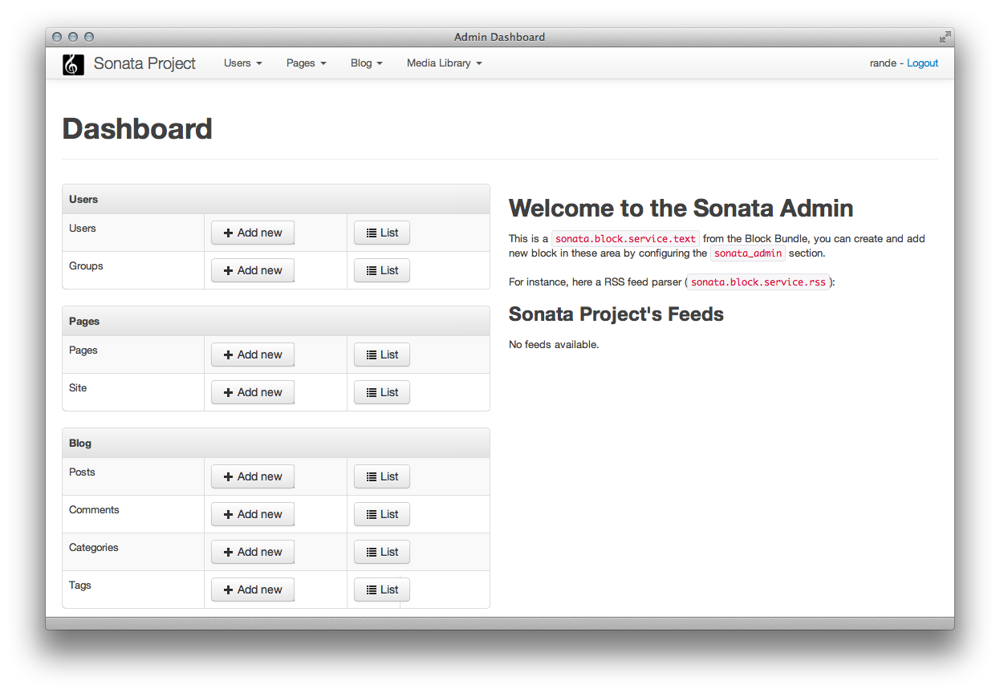

Dashboard
=========

The Dashboard is the main landing page. By default it lists your mapped models,
as defined by you using ``Admin`` services. This is useful to help you start using
``SonataAdminBundle`` right away, but there's much more that you can do to take
advantage of the Dashboard.

The Dashboard is, by default, available at ``/admin/dashboard``, which is handled by
the ``SonataAdminBundle:Core:dashboard`` controller action. The default view file for
this action is ``SonataAdminBundle:Core:dashboard.html.twig``, but you can easily change
it in your ``config.yml``:

.. code-block:: yaml

    # app/config/config.yml
    sonata_admin:
        templates:
            dashboard: SonataAdminBundle:Core:dashboard.html.twig

.. note::
    This view, like most of ``SonataAdminBundle`` views, extends a global
    template file, which also contains significant parts to the page. More information
    about this is available in the :doc:`templates` chapter.

Blocks
------

The Dashboard is actually built using ``Blocks`` from ``SonataBlockBundle``. You
can learn more about this bundle and how to build your own Blocks in its `documentation page`_.

An example of a ``Block`` is the above mentioned ``Admin`` list. It is actually implemented as a
``SonataBlockBundle`` block, that displays your configured ``Admin`` services in a nicely
formated list.

The ``Admin`` list
------------------

The ``Admin`` list is a ``Block`` that fetches information from the ``Admin`` services ``Pool`` 
and prints it in the nicely formated list you have on your default Dashboard. 
The ``Admin`` list is defined by the ``sonata.admin.block.admin_list`` service, which is
implemented by the ``Block\AdminListBlockService`` class. It is then rendered using the
``SonataAdminBundle:Block:block_admin_list.html.twig`` template file.

Feel free to take a look at these files. You'll find the code rather small and easy to
understand, and will be a great help when implementing your own blocks.

Configuring the ``Admin`` list
------------------------------

As you probably noticed by now, the ``Admin`` list groups ``Admin`` mappings together.
There are several ways in which you can configure these groups. 

Using the ``Admin`` service declaration
^^^^^^^^^^^^^^^^^^^^^^^^^^^^^^^^^^^^^^^

The first, and most commonly
used, is when defining your ``Admin`` service:

.. code-block:: xml

    <service id="sonata.admin.post" class="Acme\DemoBundle\Admin\PostAdmin">
          <tag name="sonata.admin" manager_type="orm" group="Content" label="Post"/>
          <argument />
          <argument>Acme\DemoBundle\Entity\Post</argument>
          <argument />
      </service>
      
.. code-block:: yaml

    services:
        sonata.admin.post:
            class: Acme\DemoBundle\Admin\PostAdmin
            tags:
                - { name: sonata.admin, manager_type: orm, group: "Content", label: "Post" }
            arguments:
                - ~
                - Acme\DemoBundle\Entity\Post
                - ~

In these examples, notice the ``group`` tag, stating that this particular ``Admin`` service
belongs to the ``Content`` group. 
                
.. code-block:: xml

    <service id="sonata.admin.post" class="Acme\DemoBundle\Admin\PostAdmin">
          <tag name="sonata.admin" manager_type="orm" group="acme.admin.group.content" label="acme.admin.model.post" label_catalogue="AcmeDemoBundle"/>
          <argument />
          <argument>Acme\DemoBundle\Entity\Post</argument>
          <argument />
      </service>
      
.. code-block:: yaml

    services:
        sonata.admin.post:
            class: Acme\DemoBundle\Admin\PostAdmin
            tags:
                - { name: sonata.admin, manager_type: orm, group: "acme.admin.group.content", label: "acme.admin.model.post",  label_catalogue: "AcmeDemoBundle" }
            arguments:
                - ~
                - Acme\DemoBundle\Entity\Post
                - ~

The provided labels are actually translated by ``SonataAdminBundle``, using the given
``label_catalogue``. So, you can use the above examples to support multilanguage
in your project.

Using the ``config.yml``
^^^^^^^^^^^^^^^^^^^^^^^^

You can also configure the ``Admin`` list in your ``config.yml`` file. This
configuration method overrides the configuration defined as part of the
``Admin`` services declaration.

.. code-block:: yaml

    # app/config/config.yml
    sonata_admin:
        dashboard:
            groups:
                acme.admin.group.content:
                    label: acme.admin.group.content
                    label_catalogue: AcmeDemoBundle
                    items:
                        - sonata.admin.post
                acme.admin.group.blog:
                    items: ~
                    item_adds:
                        - sonata.admin.page
                    roles: [ ROLE_ONE, ROLE_TWO ]
                acme.admin.group.misc: ~

.. note::
    This is an academic, full configuration example, meaning that in real cases, you may
    not need to use all the displayed options. Default values can be used by either 
    leaving them out of the configuration or by using the ``~`` value in the respective option.

This configuration specifies that the ``acme.admin.group.content`` group uses the
``acme.admin.group.content`` label, which is translated using the ``AcmeDemoBundle``
translation catalogue. In other words, it's the same configuration that we declared
previously, on the ``Admin`` service.

It also states that the ``acme.admin.group.content`` group contains just the 
``sonata.admin.post`` ``Admin`` mapping, meaning that any other ``Admin`` services
declared as belonging to this group will not be displayed here.

Secondly, we declare a ``acme.admin.group.blog`` as having all its default items 
(by default we mean the ones specified in the ``Admin`` services declaration), plus
an additional ``sonata.admin.page`` mapping, that was not initially part of this group.
We also use the ``roles`` option here, used to specify that , instead of being visible
to everyone, only users with ``ROLE_ONE`` or ``ROLE_TWO`` will be able to see this group. 
Users with ``ROLE_SUPER_ADMIN`` are always able to see groups that would otherwise be
hidden by this configuration option. 

The third group keeps all the default values, as declared on the ``Admin`` service
declaration.

Adding more Blocks
------------------

Like we said before, the Dashboard comes with a default ``Admin`` list block, but
you can create and add more blocks to it.

   
In this screenshot, you can see how, besides the ``Admin`` list block on the left, we added 
a text block and a RSS feed block to the right. The configuration for this scenario would be:

.. code-block:: yaml

    # app/config/config.yml
    sonata_admin:
        dashboard:
            blocks:
                - { position: left,  type: sonata.admin.block.admin_list }
                - { position: right, type: sonata.block.service.text, settings: { content: "<h2>Welcome to the Sonata Admin</h2> 
This is a <code>sonata.block.service.text</code> from the Block Bundle, you can create and add new block in these area by configuring the <code>sonata_admin</code> section.
   For instance, here a RSS feed parser (<code>sonata.block.service.rss</code>):"} }
                - { position: right, type: sonata.block.service.rss, settings: { title: Sonata Project's Feeds, url: http://sonata-project.org/blog/archive.rss }}

.. note::
    Blocks may accept/require additional settings to be passed in order to
    work properly. Refer to the associated documentation/implementation to
    get more information on each block's options and requirements.

Display two ``Admin`` list blocks with different dashboard groups
^^^^^^^^^^^^^^^^^^^^^^^^^^^^^^^^^^^^^^^^^^^^^^^^^^^^^^^^^^^^^^^^^

The same block can have multiple instances, and displayed multiple time
across the Dashboard. An particular example is the ``Admin`` list block,
which can be configured to better fit this scenario.

.. code-block:: yaml

    # app/config/config.yml
    sonata_admin:
        dashboard:
            blocks:
                # display two dashboard blocks
                - { position: left,  type: sonata.admin.block.admin_list, settings: { groups: [sonata_page1, sonata_page2] } }
                - { position: right, type: sonata.admin.block.admin_list, settings: { groups: [sonata_page3] } }

            groups:
                sonata_page1:
                    items:
                        - sonata.page.admin.myitem1
                sonata_page2:
                    items:
                        - sonata.page.admin.myitem2
                        - sonata.page.admin.myitem3
                sonata_page3:
                    items:
                        - sonata.page.admin.myitem4

In this example, you would have two ``Admin`` list blocks on your dashboard, each of
them containing just the respectively configured groups.

.. _`documentation page`:  http://sonata-project.org/bundles/block/master/doc/index.html
