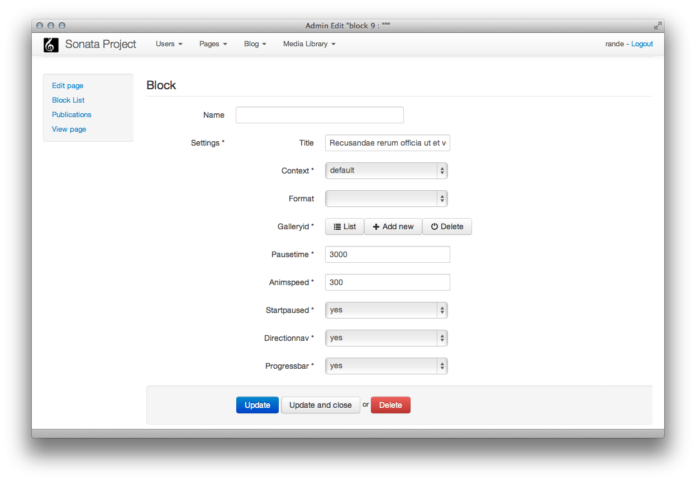

Form types and data transformers
================================

The AdminBundle is shipped with custom form types and data transfomers in order
to handle the diffent model's workflows and lifecycle.

Form types
----------

    - ``sonata_type_admin`` : this type is linked to an Admin class and the field construction is
      delegated to an Admin class.

    - ``sonata_type_collection`` : this type works like the native ``CollectionType`` but contains two extra
      features : the data layer is abstracted to work with any implemented layer and a delete option is added
      so a collection entry can be deleted.

    - ``sonata_type_model`` : this type works like the native ``EntityType`` but this internal is abstracted
      to work with any implemented layer.

    - ``sonata_type_immutable_array``: this type allows to edit a fixed array, like a settings array.

Let's say, the object have a settings properties

.. code-block:: php

    <?php
    class Page
    {
        public $settings = array(
            'content'   => 'default content',
            'public'    => true,
            'type'      => 1
        );
    }

Now you can edit the settings array with :

.. code-block:: php

    <?php
    namespace Sonata\PageBundle\Admin;

    use Sonata\AdminBundle\Admin\Admin;
    use Sonata\AdminBundle\Form\FormMapper;
    use Sonata\AdminBundle\Datagrid\DatagridMapper;
    use Sonata\AdminBundle\Datagrid\ListMapper;
    use Sonata\AdminBundle\Show\ShowMapper;
    use Sonata\AdminBundle\Validator\ErrorElement;

    class PageAdmin extends Admin
    {

        protected function configureFormFields(FormMapper $formMapper)
        {
            $formMapper
                ->add('enabled')
                ->add('settings', 'sonata_type_immutable_array', array(
                    'keys' => array(
                        array('content', 'textarea', array()),
                        array('public', 'checkbox', array()),
                        array('type', 'choice', array('choices' => array(1 => 'type 1', 2 => 'type 2')))
                    )
            );
        }
    ));

the output will be :

Other options :

.. code-block:: php

    <?php
    namespace Sonata\NewsBundle\Admin;

    use Sonata\AdminBundle\Admin\Admin;
    use Sonata\AdminBundle\Form\FormMapper;
    use Sonata\AdminBundle\Datagrid\DatagridMapper;
    use Sonata\AdminBundle\Datagrid\ListMapper;
    use Sonata\AdminBundle\Show\ShowMapper;

    use Application\Sonata\NewsBundle\Entity\Comment;

    class PostAdmin extends Admin
    {
        protected function configureFormFields(FormMapper $formMapper)
        {
            $formMapper
                ->with('General')
                    ->add('enabled', null, array('required' => false))
                    ->add('author', 'sonata_type_model', array(), array('edit' => 'list'))
                    ->add('title')
                    ->add('abstract')
                    ->add('content')
                ->end()
                ->with('Tags')
                    ->add('tags', 'sonata_type_model', array('expanded' => true))
                ->end()
                ->with('Options', array('collapsed' => true))
                    ->add('commentsCloseAt')
                    ->add('commentsEnabled', null, array('required' => false))
                    ->add('commentsDefaultStatus', 'choice', array('choices' => Comment::getStatusList()))
                ->end()
            ;
        }
    }

Datatransformer
---------------

    - ``ArrayToModelTransformer`` : transform an array to an object
    - ``ModelsToArrayTransformer`` : transform a collection of array into a collection of object
    - ``ModelToIdTransformater`` : transform an ``id`` into an object