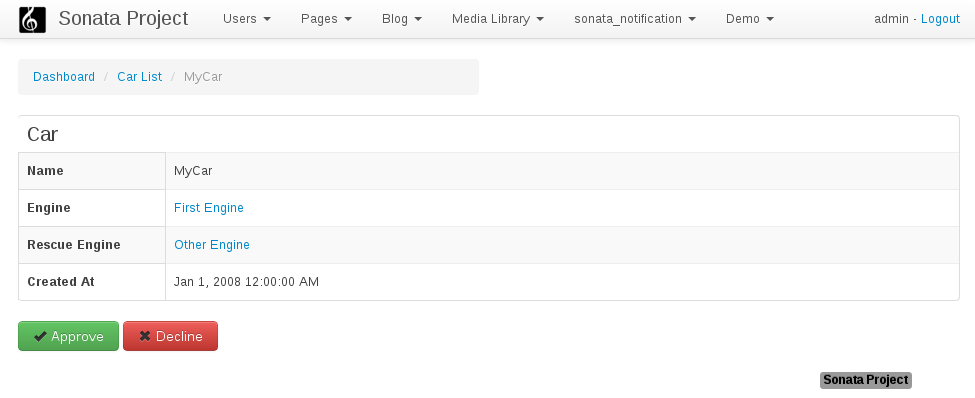

Preview Mode
============

Preview Mode is an optional view of an object before it is persisted or updated.

The preview step can be enabled for an admin entity by overriding the public property
``$supportsPreviewMode`` and setting it to true.

.. code-block:: php

    <?php
    // src/AppBundle/AdminPostAdmin.php

    class PostAdmin extends Admin
    {
        public $supportsPreviewMode = true;

        / ..
    }

This will show a new button during create/edit mode named preview.

.. figure:: ../images/preview_mode_button.png
   :align: center
   :alt: Preview Button

While in preview mode two buttons will be shown to approve or decline persistence of the
entity. Decline will send you back to the edit mode with all your changes unpersisted but
still in the form so no data is lost and the entity can be further adjusted.
Accepting the preview will store the entity as if the preview step was never there.

Simulating front-end rendering
------------------------------

Preview can be used to render how the object would look like in your front-end environment.

However by default it uses a template similar to the one of the show action and works with
the fields configured to be shown in the show view.

Overriding the preview template ``SonataAdminBundle:CRUD:preview.html.twig`` can be done either
globally through the template configuration for the key 'preview':

.. configuration-block::

    .. code-block:: yaml

        # app/config/config.yml

        sonata_admin:
            templates:
                preview:  AppBundle:CRUD:preview.html.twig

Or per admin entity by overriding the ``getTemplate($name)`` and returning the appropriate template when the key
matches 'preview':

.. code-block:: php

    <?php
    // src/AppBundle/Admin/PostAdmin.php

    // ...

    public function getTemplate($name)
    {
        switch ($name) {
            case 'preview':
                return 'AppBundle:CRUD:preview.html.twig';
                break;
            default:
                return parent::getTemplate($name);
                break;
        }
    }

In either way the template should be extending your own layout, injecting the form in it
and finally overriding the action buttons to show the approve/decline buttons like the
default preview.html.twig.

The entity is passed to the view in a variable called **object**. If your original view expects
a different object you can just set your own variables prior to calling parent().

.. code-block:: jinja

    {# 'AppBundle:CRUD:preview.html.twig #}

    

    

    

    {# a block in 'AppBundle::layout.html.twig' expecting article #}
    
        

        {{ parent() }}

        

            {{ block('parentForm') }}
        

    

    
        <button class="btn btn-success" type="submit" name="btn_preview_approve">
            <i class="fa fa-check"></i>
            {{ 'btn_preview_approve'|trans({}, 'SonataAdminBundle') }}
        </button>
        <button class="btn btn-danger" type="submit" name="btn_preview_decline">
            <i class="fa fa-times"></i>
            {{ 'btn_preview_decline'|trans({}, 'SonataAdminBundle') }}
        </button>
    

Keep in mind that the whole edit form will now appear in your view.
Hiding the fieldset tags with css ``display:none`` will be enough to only show the buttons
(which still have to be styled according to your wishes) and create a nice preview-workflow:

.. code-block:: css

    .sonata-preview-form-container .row {
        display: none;
    };

Or if you prefer less:

.. code-block:: scss

    div.sonata-preview-form-container {
        .row {
            display: none;
        };
    }
