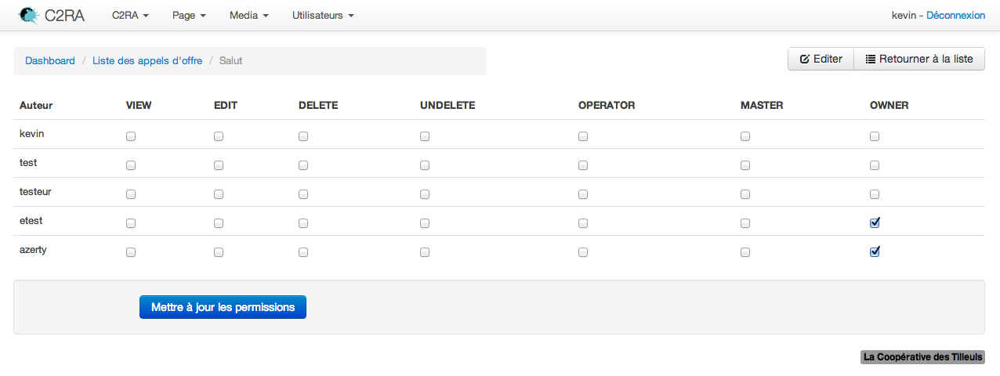

Security
========

User management
---------------

By default, the SonataAdminBundle does not come with any user management,
however it is most likely the application requires such feature. The Sonata
Project includes a ``SonataUserBundle`` which integrates the ``FOSUserBundle``.

The ``FOSUserBundle`` adds support for a database-backed user system in Symfony2.
It provides a flexible framework for user management that aims to handle common
tasks such as user login, registration and password retrieval.

The ``SonataUserBundle`` is just a thin wrapper to include the ``FOSUserBundle``
into the ``AdminBundle``. The ``SonataUserBundle`` includes:

* A default login area
* A default ``user_block`` template which is used to display the current user
  and the logout link
* 2 Admin classes: User and Group
* A default class for User and Group.

There is a little magic in the ``SonataAdminBundle``: if the bundle detects the
``SonataUserBundle`` class, then the default ``user_block`` template will be
changed to use the one provided by the ``SonataUserBundle``.

The install process is available on the dedicated
`SonataUserBundle's documentation area`_.

Security handlers
-----------------

The security part is managed by a ``SecurityHandler``, the bundle comes with 3 handlers

- ``sonata.admin.security.handler.role``: ROLES to handle permissions
- ``sonata.admin.security.handler.acl``: ACL and ROLES to handle permissions
- ``sonata.admin.security.handler.noop``: always returns true, can be used
  with the Symfony2 firewall

The default value is ``sonata.admin.security.handler.noop``, if you want to
change the default value you can set the ``security_handler`` to
``sonata.admin.security.handler.acl`` or ``sonata.admin.security.handler.role``.

To quickly secure an admin the role security can be used. It allows to specify
the actions a user can with the admin. The ACL security system is more advanced
and allows to secure the objects. For people using the previous ACL
implementation, you can switch the security_handler to the role security handler.

Configuration
~~~~~~~~~~~~~

Only the security handler is required to determine which type of security to use.
The other parameters are set as default, change them if needed.

Using roles:

.. configuration-block::

    .. code-block:: yaml

        sonata_admin:
            security:
                handler: sonata.admin.security.handler.role

Using ACL:

.. configuration-block::

    .. code-block:: yaml

        # app/config/config.yml
        sonata_admin:
            security:
                handler: sonata.admin.security.handler.acl
                # acl security information
                information:
                    GUEST:    [VIEW, LIST]
                    STAFF:    [EDIT, LIST, CREATE]
                    EDITOR:   [OPERATOR, EXPORT]
                    ADMIN:    [MASTER]
                # permissions not related to an object instance and also to be available when objects do not exist
                # the DELETE admin permission means the user is allowed to batch delete objects
                admin_permissions: [CREATE, LIST, DELETE, UNDELETE, EXPORT, OPERATOR, MASTER]
                # permission related to the objects
                object_permissions: [VIEW, EDIT, DELETE, UNDELETE, OPERATOR, MASTER, OWNER]

Later, we will explain how to set up ACL with the
``FriendsOfSymfony/UserBundle``.

Role handler
-----------------

The ``sonata.admin.security.handler.role`` allows you to operate finely on the actions that can be done (den peding on the entity class), without requiring to set up ACL.

Configuration
~~~~~~~~~~~~~

First, activate the role security handler as described above.

Each time an user tries to do an action in the admin, Sonata checks if he is either a super admin (``ROLE_SUPER_ADMIN``) **or** has the permission.

The permissions are:

* LIST: view the list of objects
* VIEW: view the detail of one object
* CREATE: create a new object
* EDIT: update an existing object
* DELETE: delete an existing object
* EXPORT (for the native Sonata export links)

Each permission is relative to an admin: if you try to get a list in FooAdmin (declared as ``sonata.admin.demo.foo``
service), Sonata will check if the user has the ``ROLE_SONATA_ADMIN_DEMO_FOO_EDIT`` role.

So our ``security.yml`` file may look to something like this:

.. configuration-block::

    .. code-block:: yaml

        security:
            ...
            role_hierarchy:
                # for convenience, I decided to gather Sonata roles here
                ROLE_SONATA_FOO_READER:
                    - ROLE_SONATA_ADMIN_DEMO_FOO_LIST
                    - ROLE_SONATA_ADMIN_DEMO_FOO_VIEW
                ROLE_SONATA_FOO_EDITOR:
                    - ROLE_SONATA_ADMIN_DEMO_FOO_CREATE
                    - ROLE_SONATA_ADMIN_DEMO_FOO_EDIT
                ROLE_SONATA_FOO_ADMIN:
                    - ROLE_SONATA_ADMIN_DEMO_FOO_DELETE
                    - ROLE_SONATA_ADMIN_DEMO_FOO_EXPORT
                # those are the roles I will use (less verbose)
                ROLE_STAFF:             [ROLE_USER, ROLE_SONATA_FOO_READER]
                ROLE_ADMIN:             [ROLE_STAFF, ROLE_SONATA_FOO_EDITOR, ROLE_SONATA_FOO_ADMIN]
                ROLE_SUPER_ADMIN:       [ROLE_ADMIN, ROLE_ALLOWED_TO_SWITCH]

            # set access_strategy to unanimous, else you may have unexpected behaviors
            access_decision_manager:
                strategy: unanimous

Note that we also set ``access_strategy`` to unanimous.
It means that if one voter (for example Sonata) refuses access, access will be denied.
For more information on this subject, please see `changing the access decision strategy`_
in the Symfony documentation.

Usage
~~~~~

You can now test if an user is authorized from an Admin class:

.. code-block:: php

        if ($this->isGranted('LIST')) {
            ...
        }

From a controller extending ``Sonata\AdminBundle\Controller\CRUDController``:

.. code-block:: php

        if ($this->admin->isGranted('LIST')) {
            ...
        }

Or from a Twig template:

.. code-block:: jinja

        
            
Hello there!

        

Note that you don't have to re-specify the prefix.

Sonata check those permissions for the action it handles internally. Of course you will have to recheck them in your own code.

Yon can also create your own permissions, for example ``EMAIL`` (which will turn into role ``ROLE_SONATA_ADMIN_DEMO_FOO_EMAIL``).

Going further
~~~~~~~~~~~~~

Because Sonata role handler supplements Symfony2 security, but does not override it, you are free to do more advanced operations.
For example, you can `create your own voter`_

Customizing the handler behavior
~~~~~~~~~~~~~~~~~~~~~~~~~~~~~~~~

If you want to change the handler behavior (for example, to pass the current object to voters), extend
``Sonata\AdminBundle\Security\Handler\RoleSecurityHandler``, and override the ``isGranted`` method.

Then declare your handler as a service:

.. configuration-block::

    .. code-block:: xml

        <parameters>
            <parameter key="acme.demo.security.handler.role.class" >Acme\DemoBundle\Security\Handler\RoleSecurityHandler</parameter>
        </parameters>
        <services>
            <service id="acme.demo.security.handler.role" class="%acme.demo.security.handler.role.class%" public="false">
                <argument type="service" id="security.context" on-invalid="null" />
                <argument type="collection">
                    <argument>ROLE_SUPER_ADMIN</argument>
                </argument>
            </service>
        ...

And specify it as Sonata security handler on your configuration (``config.yml``):

.. configuration-block::

    .. code-block:: yaml

        sonata_admin:
            security:
                handler: acme.demo.security.handler.role

ACL and FriendsOfSymfony/UserBundle
-----------------------------------

If you want an easy way to handle users, please use:

- `FOSUserBundle <https://github.com/FriendsOfSymfony/FOSUserBundle>`_: handle users and groups
  stored in RDMS or MongoDB
- `SonataUserBundle <https://github.com/sonata-project/SonataUserBundle>`_: integrates the
  ``FriendsOfSymfony/UserBundle`` with the ``AdminBundle``

The security integration is a work in progress and has some known issues:

- ACL permissions are immutables
- A listener must be implemented that creates the object Access Control List
  with the required rules if objects are created outside the Admin

Configuration
~~~~~~~~~~~~~

Before you can use ``FriendsOfSymfony/FOSUserBundle`` you need to set it up as
described in the documentation of the bundle. In step 4 you need to create a
User class (in a custom UserBundle). Do it as follows:

.. code-block:: php

    <?php

    namespace Acme\UserBundle\Entity;

    use Sonata\UserBundle\Entity\BaseUser as BaseUser;
    use Doctrine\ORM\Mapping as ORM;

    /**
     * @ORM\Entity
     * @ORM\Table(name="fos_user")
    \*/
    class User extends BaseUser
    {
        /**
         * @ORM\Id
         * @ORM\Column(type="integer")
         * @ORM\GeneratedValue(strategy="AUTO")
         \*/
        protected $id;

        public function __construct()
        {
            parent::__construct();
            // your own logic
        }
    }

In your ``app/config/config.yml`` you then need to put the following:

.. configuration-block::

    .. code-block:: yaml

        fos_user:
            db_driver: orm
            firewall_name: main
            user_class: Acme\UserBundle\Entity\User

The following configuration for the SonataUserBundle defines:

- the ``FriendsOfSymfony/FOSUserBundle`` as a security provider
- the login form for authentication
- the access control: resources with related required roles, the important
  part is the admin configuration
- the ``acl`` option to enable the ACL.
- the ``AdminPermissionMap`` defines the permissions of the Admin class

.. configuration-block::

    .. code-block:: yaml

        # app/config/security.yml

        parameters:
            # ... other parameters
            security.acl.permission.map.class: Sonata\AdminBundle\Security\Acl\Permission\AdminPermissionMap
            # optionally use a custom MaskBuilder
            #sonata.admin.security.mask.builder.class: Sonata\AdminBundle\Security\Acl\Permission\MaskBuilder

In ``app/config/security.yml``:

.. configuration-block::

    .. code-block:: yaml

        security:
            providers:
                fos_userbundle:
                    id: fos_user.user_manager

            firewalls:
                main:
                    pattern:      .*
                    form-login:
                        provider:       fos_userbundle
                        login_path:     /login
                        use_forward:    false
                        check_path:     /login_check
                        failure_path:   null
                    logout:       true
                    anonymous:    true

            access_control:
                # The WDT has to be allowed to anonymous users to avoid requiring the login with the AJAX request
                - { path: ^/wdt/, role: IS_AUTHENTICATED_ANONYMOUSLY }
                - { path: ^/profiler/, role: IS_AUTHENTICATED_ANONYMOUSLY }

                # AsseticBundle paths used when using the controller for assets
                - { path: ^/js/, role: IS_AUTHENTICATED_ANONYMOUSLY }
                - { path: ^/css/, role: IS_AUTHENTICATED_ANONYMOUSLY }

                # URL of FOSUserBundle which need to be available to anonymous users
                - { path: ^/login$, role: IS_AUTHENTICATED_ANONYMOUSLY }
                - { path: ^/login_check$, role: IS_AUTHENTICATED_ANONYMOUSLY } # for the case of a failed login
                - { path: ^/user/new$, role: IS_AUTHENTICATED_ANONYMOUSLY }
                - { path: ^/user/check-confirmation-email$, role: IS_AUTHENTICATED_ANONYMOUSLY }
                - { path: ^/user/confirm/, role: IS_AUTHENTICATED_ANONYMOUSLY }
                - { path: ^/user/confirmed$, role: IS_AUTHENTICATED_ANONYMOUSLY }
                - { path: ^/user/request-reset-password$, role: IS_AUTHENTICATED_ANONYMOUSLY }
                - { path: ^/user/send-resetting-email$, role: IS_AUTHENTICATED_ANONYMOUSLY }
                - { path: ^/user/check-resetting-email$, role: IS_AUTHENTICATED_ANONYMOUSLY }
                - { path: ^/user/reset-password/, role: IS_AUTHENTICATED_ANONYMOUSLY }

                # Secured part of the site
                # This config requires being logged for the whole site and having the admin role for the admin part.
                # Change these rules to adapt them to your needs
                - { path: ^/admin/, role: ROLE_ADMIN }
                - { path: ^/.*, role: IS_AUTHENTICATED_ANONYMOUSLY }

            role_hierarchy:
                ROLE_ADMIN:       [ROLE_USER, ROLE_SONATA_ADMIN]
                ROLE_SUPER_ADMIN: [ROLE_ADMIN, ROLE_ALLOWED_TO_SWITCH]

            acl:
                connection: default

- Install the ACL tables ``php app/console init:acl``

- Create a new root user:

.. code-block:: sh

    # php app/console fos:user:create --super-admin
        Please choose a username:root
        Please choose an email:root@domain.com
        Please choose a password:root
        Created user root

If you have Admin classes, you can install or update the related CRUD ACL rules:

.. code-block:: sh

    # php app/console sonata:admin:setup-acl
    Starting ACL AdminBundle configuration
    > install ACL for sonata.media.admin.media
       - add role: ROLE_SONATA_MEDIA_ADMIN_MEDIA_GUEST, permissions: ["VIEW","LIST"]
       - add role: ROLE_SONATA_MEDIA_ADMIN_MEDIA_STAFF, permissions: ["EDIT","LIST","CREATE"]
       - add role: ROLE_SONATA_MEDIA_ADMIN_MEDIA_EDITOR, permissions: ["OPERATOR","EXPORT"]
       - add role: ROLE_SONATA_MEDIA_ADMIN_MEDIA_ADMIN, permissions: ["MASTER"]
    ... skipped ...

If you already have objects, you can generate the object ACL rules for each
object of an admin:

.. code-block:: sh

    $ php app/console sonata:admin:generate-object-acl

Optionally, you can specify an object owner, and step through each admin. See
the help of the command for more information.

If you try to access to the admin class you should see the login form, just
log in with the ``root`` user.

An Admin is displayed in the dashboard (and menu) when the user has the role
``LIST``. To change this override the ``showIn`` method in the Admin class.

Roles and Access control lists
~~~~~~~~~~~~~~~~~~~~~~~~~~~~~~
A user can have several roles when working with an application. Each Admin class
has several roles, and each role specifies the permissions of the user for the
``Admin`` class. Or more specifically, what the user can do with the domain object(s)
the ``Admin`` class is created for.

By default each ``Admin`` class contains the following roles, override the
property ``$securityInformation`` to change this:

- ``ROLE_SONATA_..._GUEST``
    a guest that is allowed to ``VIEW`` an object and a ``LIST`` of objects;
- ``ROLE_SONATA_..._STAFF``
    probably the biggest part of the users, a staff user  has the same permissions as guests and is additionally allowed to ``EDIT`` and ``CREATE`` new objects;
- ``ROLE_SONATA_..._EDITOR``
    an editor is granted all access and, compared to the staff users, is allowed to ``DELETE``;
- ``ROLE_SONATA_..._ADMIN``
    an administrative user is granted all access and on top of that, the user is allowed to grant other users access.

Owner:

- when an object is created, the currently logged in user is set as owner for
  that object and is granted all access for that object;
- this means the user owning the object is always allowed to ``DELETE`` the
  object, even when it only has the staff role.

Vocabulary used for Access Control Lists:

- **Role:** a user role;
- **ACL:** a list of access rules, the Admin uses 2 types:
- **Admin ACL:** created from the Security information of the Admin class
  for  each admin and shares the Access Control Entries that specify what
  the  user can do (permissions) with the admin
- **Object ACL:** also created from the security information of the ``Admin``
  class however created for each object, it uses 2 scopes:

  - **Class-Scope:** the class scope contains the rules that are valid
    for all object of a certain class;
  - **Object-Scope:** specifies the owner;
- **Sid:** Security identity, an ACL role for the Class-Scope ACL and the
  user for the Object-Scope ACL;
- **Oid:** Object identity, identifies the ACL, for the admin ACL this is
  the admin code, for the object ACL this is the object id;
- **ACE:** a role (or sid) and its permissions;
- **Permission:** this tells what the user is allowed to do with the Object
  identity;
- **Bitmask:** a permission can have several bitmasks, each bitmask
  represents a permission. When permission ``VIEW`` is requested and it
  contains the ``VIEW`` and ``EDIT`` bitmask and the user only has the
  ``EDIT`` permission, then the permission ``VIEW`` is granted.
- **PermissionMap:** configures the bitmasks for each permission, to change
  the default mapping create a voter for the domain class of the Admin.

  There can be many voters that may have different permission maps. However,
  prevent that multiple voters vote on the same class with overlapping bitmasks.

See the cookbook article "`Advanced ACL concepts 
<http://symfony.com/doc/current/cookbook/security/acl_advanced.html#pre-authorization-decisions.>`_" 
for the meaning of the different permissions.

How is access granted?
~~~~~~~~~~~~~~~~~~~~~~

In the application the security context is asked if access is granted for a role
or a permission (``admin.isGranted``):

- **Token:** a token identifies a user between requests;
- **Voter:** sort of judge that returns if access is granted of denied, if the
  voter should not vote for a case, it returns abstrain;
- **AccessDecisionManager:** decides if access is granted or denied according
  a specific strategy. It grants access if at least one (affirmative strategy),
  all (unanimous strategy) or more then half (consensus strategy) of the
  counted votes granted access;
- **RoleVoter:** votes for all attributes stating with ``ROLE_`` and grants
  access if the user has this role;
- **RoleHierarchieVoter:** when the role ``ROLE_SONATA_ADMIN`` is voted for,
  it also votes "granted" if the user has the role ``ROLE_SUPER_ADMIN``;
- **AclVoter:** grants access for the permissions of the ``Admin`` class if
  the user has the permission, the user has a permission that is included in
  the bitmasks of the permission requested to vote for or the user owns the
  object.

Create a custom voter or a custom permission map
~~~~~~~~~~~~~~~~~~~~~~~~~~~~~~~~~~~~~~~~~~~~~~~~

In some occasions you need to create a custom voter or a custom permission map
because for example you want to restrict access using extra rules:

- create a custom voter class that extends the ``AclVoter``

  .. code-block:: php

      <?php

      namespace Acme\DemoBundle\Security\Authorization\Voter;

      use FOS\UserBundle\Model\UserInterface;
      use Symfony\Component\Security\Core\Authentication\Token\TokenInterface;
      use Symfony\Component\Security\Acl\Voter\AclVoter;

      class UserAclVoter extends AclVoter
      {
          /**
          * {@InheritDoc}
          */
          public function supportsClass($class)
          {
              // support the Class-Scope ACL for votes with the custom permission map
              // return $class === 'Sonata\UserBundle\Admin\Entity\UserAdmin' || $is_subclass_of($class, 'FOS\UserBundle\Model\UserInterface');
              // if you use php >=5.3.7 you can check the inheritance with is_a($class, 'Sonata\UserBundle\Admin\Entity\UserAdmin');
              // support the Object-Scope ACL
              return is_subclass_of($class, 'FOS\UserBundle\Model\UserInterface');
          }

          public function supportsAttribute($attribute)
          {
              return $attribute === 'EDIT' || $attribute === 'DELETE';
          }

          public function vote(TokenInterface $token, $object, array $attributes)
          {
              if (!$this->supportsClass(get_class($object))) {
                  return self::ACCESS_ABSTAIN;
              }

              foreach ($attributes as $attribute) {
                  if ($this->supportsAttribute($attribute) && $object instanceof UserInterface) {
                      if ($object->isSuperAdmin() && !$token->getUser()->isSuperAdmin()) {
                          // deny a non super admin user to edit a super admin user
                          return self::ACCESS_DENIED;
                      }
                  }
              }

              // use the parent vote with the custom permission map:
              // return parent::vote($token, $object, $attributes);
              // otherwise leave the permission voting to the AclVoter that is using the default permission map
              return self::ACCESS_ABSTAIN;
          }
      }

- optionally create a custom permission map, copy to start the
  ``Sonata\AdminBundle\Security\Acl\Permission\AdminPermissionMap.php`` to
  your bundle

- declare the voter and permission map as a service

    .. configuration-block::

      .. code-block:: xml

          <!-- src/Acme/DemoBundle/Resources/config/services.xml -->

          <parameters>
              <parameter key="security.acl.user_voter.class">Acme\DemoBundle\Security\Authorization\Voter\UserAclVoter</parameter>
              <!-- <parameter key="security.acl.user_permission.map.class">Acme\DemoBundle\Security\Acl\Permission\UserAdminPermissionMap</parameter> -->
          </parameters>

          <services>
              <!-- <service id="security.acl.user_permission.map" class="%security.acl.permission.map.class%" public="false"></service> -->

              <service id="security.acl.voter.user_permissions" class="%security.acl.user_voter.class%" public="false">
                  <tag name="monolog.logger" channel="security" />
                  <argument type="service" id="security.acl.provider" />
                  <argument type="service" id="security.acl.object_identity_retrieval_strategy" />
                  <argument type="service" id="security.acl.security_identity_retrieval_strategy" />
                  <argument type="service" id="security.acl.permission.map" />
                  <argument type="service" id="logger" on-invalid="null" />
                  <tag name="security.voter" priority="255" />
              </service>
          </services>

- change the access decision strategy to ``unanimous``

    .. configuration-block::

      .. code-block:: yaml

          # app/config/security.yml
          security:
              access_decision_manager:
                  # Strategy can be: affirmative, unanimous or consensus
                  strategy: unanimous

- to make this work the permission needs to be checked using the Object ACL

  - modify the template (or code) where applicable:

    .. code-block:: html+jinja

         {# ... #} 

  - because the object ACL permission is checked, the ACL for the object must
    have been created, otherwise the ``AclVoter`` will deny ``EDIT`` access
    for a non super admin user trying to edit another non super admin user.
    This is automatically done when the object is created using the Admin.
    If objects are also created outside the Admin, have a look at the
    ``createSecurityObject`` method in the ``AclSecurityHandler``.

Usage
~~~~~

Every time you create a new ``Admin`` class, you should start with the command
``php app/console sonata:admin:setup-acl`` so the ACL database will be updated
with the latest roles and permissions.

In the templates, or in your code, you can use the Admin method ``isGranted()``:

- check for an admin that the user is allowed to ``EDIT``:

  .. code-block:: html+jinja

      {# use the admin security method  #}
       {# ... #} 

      {# or use the default is_granted symfony helper, the following will give the same result #}
       {# ... #} 

- check for an admin that the user is allowed to ``DELETE``, the object is added
  to also check if the object owner is allowed to ``DELETE``:

  .. code-block:: html+jinja

      {# use the admin security method  #}
       {# ... #} 

      {# or use the default is_granted symfony helper, the following will give the same result #}
       {# ... #} 

List filtering
~~~~~~~~~~~~~~

List filtering using ACL is available as a third party bundle: `CoopTilleulsAclSonataAdminExtensionBundle <https://github.com/coopTilleuls/CoopTilleulsAclSonataAdminExtensionBundle>`_.  
When enabled, the logged in user will only see the objects for which it has the `VIEW` right (or superior).

ACL editor
----------

SonataAdminBundle provides a user-friendly ACL editor
interface.
It will be automatically available if the ``sonata.admin.security.handler.acl``
security handler is used and properly configured.

The ACL editor is only available for users with `OWNER` or `MASTER` permissions
on the object instance.
The `OWNER` and `MASTER` permissions can only be edited by an user with the
`OWNER` permission on the object instance.

User list customization
~~~~~~~~~~~~~~~~~~~~~~~

By default, the ACL editor allows to set permissions for all users managed by
``FOSUserBundle``.

To customize displayed user override
`Sonata\AdminBundle\Controller\CRUDController::getAclUsers()`. This method must
return an iterable collection of users.

.. code-block:: php

    /**
     * {@InheritDoc}
     */
    protected function getAclUsers()
    {
        $userManager = $container->get('fos_user.user_manager');

        // Display only kevin and anne
        $kevin = $userManager->findUserByUsername('kevin');
        $anne = $userManager->findUserByUsername('anne');

        return array($kevin, $anne);
    }

Custom user manager
~~~~~~~~~~~~~~~~~~~

If your project does not use `FOSUserBundle`, you can globally configure another
service to use when retrieving your users.

- Create a service with a method called `findUsers()` returning an iterable
  collection of users
- Update your admin configuration to reference your service name

.. configuration-block::

    .. code-block:: yaml

        sonata_admin:
            security:
                acl_user_manager: my_user_manager # The name of your service

.. _`SonataUserBundle's documentation area`: http://sonata-project.org/bundles/user/master/doc/reference/installation.html
.. _`changing the access decision strategy`: http://symfony.com/doc/2.2/cookbook/security/voters.html#changing-the-access-decision-strategy
.. _`create your own voter`: http://symfony.com/doc/2.2/cookbook/security/voters.html
