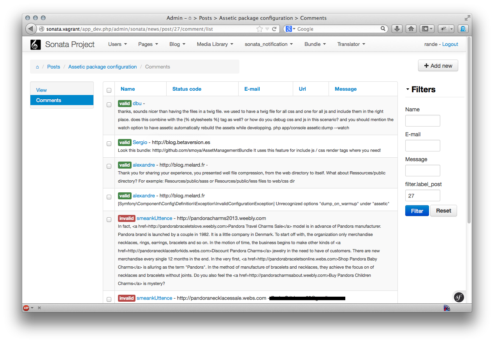

Templates
=========

By default, an Admin class uses a set of templates, it is possible to tweak the default values by editing the configuration

.. code-block:: yaml

    sonata_admin:
        templates:
            # default global templates
            layout:  SonataAdminBundle::standard_layout.html.twig
            ajax:    SonataAdminBundle::ajax_layout.html.twig

            # default values of actions templates, they should extend global templates
            list:    SonataAdminBundle:CRUD:list.html.twig
            show:    SonataAdminBundle:CRUD:show.html.twig
            edit:    SonataAdminBundle:CRUD:edit.html.twig
            history: SonataAdminBundle:CRUD:history.html.twig
            preview: SonataAdminBundle:CRUD:preview.html.twig
            delete:  SonataAdminBundle:CRUD:delete.html.twig
            batch:   SonataAdminBundle:CRUD:list__batch.html.twig
            batch_confirmation: SonataAdminBundle:CRUD:batch_confirmation.html.twig

            # list related templates
            inner_list_row: SonataAdminBundle:CRUD:list_inner_row.html.twig
            base_list_field: SonataAdminBundle:CRUD:base_list_field.html.twig

            # default values of helper templates
            short_object_description: SonataAdminBundle:Helper:short-object-description.html.twig

            # default values of block templates, they should extend the base_block template
            list_block: SonataAdminBundle:Block:block_admin_list.html.twig

Usage of each template :

* layout : base layout used by the dashboard and an admin class
* ajax : default layout used when an ajax request is performed
* dashboard: default layout used at the dashboard
* list : the template to use for the list action
* show : the template to use for the show action
* edit : the template to use for the edit and create action
* history : the template to use for the history / audit action
* list_block : the template used for the list of admin blocks on the dashboard
* preview : the template to use for previewing an edit / create action
* short_object_description: used to represent the entity in one-to-one/many-to-one relations
* delete: the template to use for the delete action
* inner_list_row: the template to render a list row

The default values will be set only if the ``Admin::setTemplates`` is not called by the Container.

You can easily extend the provided templates in your own and customize only the blocks you need to change:

.. code-block:: jinja

    
    {# Acme/MyBundle/Resources/view/my-custom-edit.html.twig #}

    
        {{ "My title"|trans }}
    

    
         

             <ul>
                 
                     <li class="btn sonata-action-element"><a href="{{ admin.generateUrl('list') }}">{{ 'link_action_list'|trans({}, 'SonataAdminBundle') }}</a></li>
                 
             </ul>
         

    

.. code-block:: php

    <?php // MyAdmin.php

    public function getTemplate($name)
    {
        switch ($name) {
            case 'edit':
                return 'AcmeMyBundle::my-custom-edit.html.twig';
                break;
            default:
                return parent::getTemplate($name);
                break;
        }
    }

Row Template
------------

From 2.2, it is possible to define a template per row for the list action, the default one is a standard table. However,
depends on the data the table layout might not be suitable. So by defining a custom template for the row, it will be
possible to tweak the layout as:

How to use it
~~~~~~~~~~~~~

The configuration takes place in the DIC by calling the ``setTemplates`` method. Two template keys need to be set:

- ``inner_list_row`` : The template for the row, this one need to be customized
- ``base_list_field`` : The base template for the cell, the ``SonataAdminBundle:CRUD:base_list_flat_field.html.twig``
is suitable for most cases, however advance use might want to change it.

.. code-block:: xml

    <service id="sonata.news.admin.comment" class="%sonata.news.admin.comment.class%">
        <tag name="sonata.admin" manager_type="orm" group="sonata_blog" label="comments" label_catalogue="%sonata.news.admin.comment.translation_domain%" label_translator_strategy="sonata.admin.label.strategy.underscore" />
        <argument />
        <argument>%sonata.news.admin.comment.entity%</argument>
        <argument>%sonata.news.admin.comment.controller%</argument>

        <call method="setTemplates">
            <argument type="collection">
                <argument key="inner_list_row">SonataNewsBundle:Admin:inner_row_comment.html.twig</argument>
                <argument key="base_list_field">SonataAdminBundle:CRUD:base_list_flat_field.html.twig</argument>
            </argument>
        </call>
    </service>

Once the template is set, edit the template ``SonataNewsBundle:Admin:inner_row_comment.html.twig``

.. code-block:: jinja

    {# The default template which provides batch and action cells, with the valid colspan computation #}
    

    

        {# use field define in the the Admin class #}
        {{ object|render_list_element(admin.list['name']) }} -
        {{ object|render_list_element(admin.list['url']) }} -
        {{ object|render_list_element(admin.list['email']) }}  

        <small>
            {# or you can use the object variable to render a property #}
            {{ object.message }}
        </small>

    

While this feature is nice to generate rich list, it is also very easy to break the layout and admin features: batch and actions.
