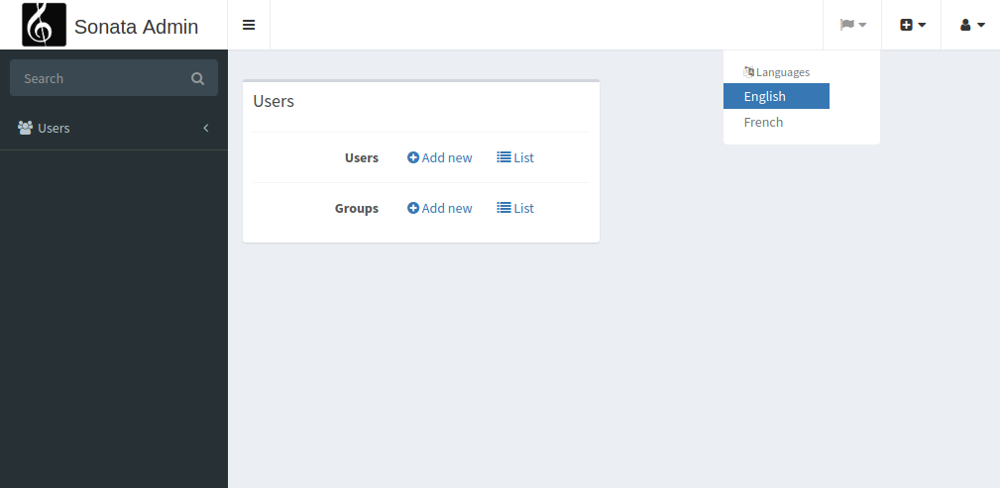

Creating a locale switcher
==========================

This is a full working example of creating a locale switcher.

.. note::
    This article assumes you are using Symfony 4, Flex, and autowiring.

Prerequisites
-------------

Install the following Sonata dependencies:

* `Sonata Intl Bundle`_

Create a ``LocaleSubscriber`` and a ``UserLocaleSubscriber`` class as explained
`here`_.

.. note::
    The ``SonataIntlBundle`` bundle is optional, but will allow the list
    of locales to be shown as a list of languages.

Handle locale switch
--------------------

Create a controller to handle locale switch in ``src/Controller/LocaleController.php``:

.. code-block:: php

    <?php

    namespace App\Controller;

    use Symfony\Bundle\FrameworkBundle\Controller\AbstractController;
    use Symfony\Component\Routing\Annotation\Route;
    use Symfony\Component\HttpFoundation\Request;
    use Symfony\Component\HttpFoundation\RedirectResponse;

    final class LocaleController
    {
        /**
        * @Route("/locale/{locale}", name="locale")
        */
        public function index(Request $request, string $locale): RedirectResponse
        {
            $request->getSession()->set('_locale', $locale);
            return new RedirectResponse($request->headers->get('referer', '/'));
        }
    }

Override the standard layout
----------------------------

Create ``src/templates/bundles/SonataAdminBundle/standard_layout.html.twig``:

.. code-block:: twig

    

    
        {{ parent() }}
        

            <ul class="nav navbar-nav">
                
                    <li class="dropdown">
                        <a class="dropdown-toggle" data-toggle="dropdown" href="#">
                            <i class="fa fa-flag fa-fw" aria-hidden="true"></i>
                            <i class="fa fa-caret-down" aria-hidden="true"></i>
                        </a>
                        

                            

                                

                                    <ul class="dropdown-menu">
                                        <li role="presentation" class="dropdown-header">
                                            <i class="fa fa-language"></i>
                                            {{ 'languages_title'|trans({}, 'SonataAdminBundle') }}
                                        </li>
                                        
                                        <li role="presentation" class="{{ app.request.locale == locale ? 'active' : '' }}">
                                            <a role="menuitem" tabindex="-1" href="{{ path('locale', {'locale': locale}) }}">
                                                {{ locale|language|capitalize }}
                                            </a>
                                        </li>
                                        
                                    </ul>
                                

                            

                        

                    </li>
                
            </ul>
        

    

.. note::
    If you chose not to install ``SonataIntlBundle``, the Twig language
    helper is not available, and you must replace ``{{ locale|language|
    capitalize }}`` with just ``{{ locale }}``.

Update your config to make it work
----------------------------------

Create the ``available_locales`` twig parameter by adding this to ``config/packages/twig.yaml``:

.. code-block:: yaml

    twig:
        ...
        globals:
            available_locales: '%app.locales%'

Make sure ``app.locales`` is defined in ``config/services.yaml``:

.. code-block:: yaml

    parameters:
        ...
        app.locales: en|fr

Done!
-----

You are done and you probably want to know how this looks like in the admin
interface. Well, let's find out by going to /admin

.. _`Sonata Easy-Extends Bundle`: https://sonata-project.org/bundles/easy-extends
.. _`Sonata Intl Bundle`: https://sonata-project.org/bundles/intl
.. _`here`: https://symfony.com/doc/current/session/locale_sticky_session.html
