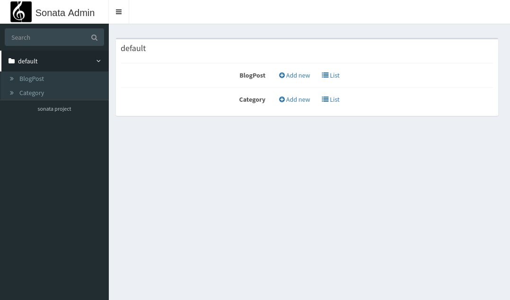

Creating an Admin with Annotations
==================================

If you are a fan of annotations, there is a 3rd party bundle that allows
using annotations instead of creating admin classes.

Download the SonataAnnotationBundle
-----------------------------------

.. code-block:: bash

    $ composer require kunicmarko/sonata-annotation-bundle

How to use
----------

Let's say we have a ``BlogPost`` entity that is connected to a ``Category`` entity
like in the `getting started chapter`_:

.. code-block:: php

    <?php

    namespace App\Entity;

    use Doctrine\ORM\Mapping as ORM;
    use KunicMarko\SonataAnnotationBundle\Annotation as Sonata;
    // ...

    /**
     * @Sonata\Admin("BlogPost")
     *
     * @ORM\Table
     * @ORM\Entity
     */
    class BlogPost
    {
        // ...

        /**
         * @Sonata\ListField()
         * @Sonata\FormField()
         *
         * @ORM\Column(name="title", type="string")
         */
        private $title;

        /**
         * @Sonata\ListAssociationField(field="name")
         * @Sonata\FormField()
         *
         * @ORM\ManyToOne(targetEntity="Category", inversedBy="blogPosts")
         */
        private $category;

        // ...
    }

.. code-block:: php

    <?php

    namespace App\Entity;

    use Doctrine\ORM\Mapping as ORM;
    use KunicMarko\SonataAnnotationBundle\Annotation as Sonata;
    // ...

    /**
     * @Sonata\Admin("Category")
     *
     * @ORM\Table
     * @ORM\Entity
     */
    class Category
    {
        // ...

        /**
         * @Sonata\ListField()
         * @Sonata\FormField()
         *
         * @ORM\Column(name="name", type="string")
         */
        private $name;

        /**
        * @ORM\OneToMany(targetEntity="BlogPost", mappedBy="category")
        */
        private $blogPosts;

        // ...
    }

Do not forget to clear your cache:

.. code-block:: bash

    $ bin/console cache:clear

You are done and you probably want to know how this looks like in the admin
interface. Well, let's find out by going to http://localhost:8000/admin

The rest of the Annotation and their options can be found `here`_.

.. _`getting started chapter`: https://sonata-project.org/bundles/admin/3-x/doc/getting_started/creating_an_admin.html
.. _`here`: https://github.com/kunicmarko20/SonataAnnotationBundle#annotations
