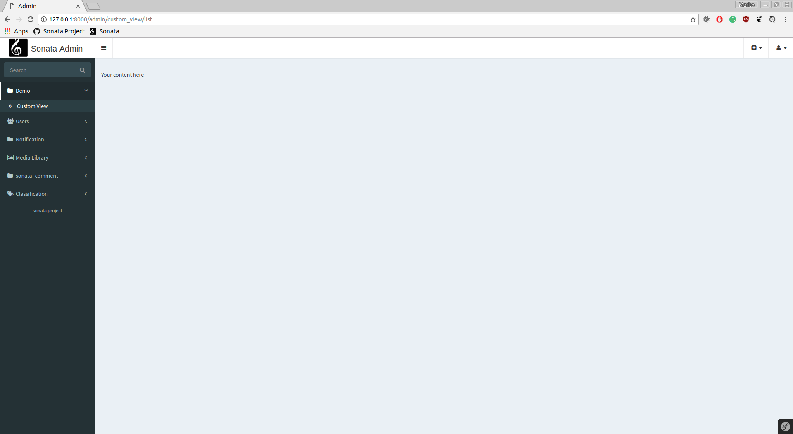

Creating a Custom Admin View
============================

Sometimes, you may want to create an additional view in your Sonata admin
but you do not have or need an Entity to connect it to. You also probably
want to add it to the sidebar with the rest of your admin pages. Here we will
present a full working example of how that is achievable.

The recipe
----------

SonataAdmin provides a very straightforward way of adding your own custom
view.

To do this we need to:

- create an admin class for your custom view;
- extend the ``SonataAdmin:CRUD`` Controller and tell our admin class to
  use it;
- create a template that will represent your custom view.

Create an admin class
^^^^^^^^^^^^^^^^^^^^^

First we need to create an admin class and we will clear all routes except
``list``.

::

    <?php

    // src/Admin/CustomViewAdmin.php

    namespace App\Admin;

    use Sonata\AdminBundle\Admin\AbstractAdmin;
    use Sonata\AdminBundle\Route\RouteCollection;

    class CustomViewAdmin extends AbstractAdmin
    {
        protected $baseRoutePattern = 'custom_view';
        protected $baseRouteName = 'custom_view';

        protected function configureRoutes(RouteCollection $collection)
        {
            $collection->clearExcept(['list']);
        }
    }

Extending the Admin Controller
^^^^^^^^^^^^^^^^^^^^^^^^^^^^^^

Create your own Controller extending the one from SonataAdmin.

::

    <?php

    // src/Controller/CustomViewCRUDController.php

    namespace App\Controller;

    use Sonata\AdminBundle\Controller\CRUDController;

    class CustomViewCRUDController extends CRUDController
    {
        public function listAction()
        {
            return $this->renderWithExtraParams('admin/custom_view.html.twig');
        }
    }

Admin classes by default use the ``SonataAdmin:CRUD`` controller, this is the third parameter
of an admin service definition, you need to change it to your own.

Register the Admin as a Service
^^^^^^^^^^^^^^^^^^^^^^^^^^^^^^^

The difference between creating a normal admin class and this one is
that we do not specify the Entity, we leave it as ``null``.

.. code-block:: yaml

    # config/services.yaml

    services:
        app.admin.custom_view:
            class: App\Admin\CustomViewAdmin
            tags:
                - { name: sonata.admin, manager_type: orm, group: Demo, label: Custom View }
            arguments:
                - ~
                - ~
                - App\Controller\CustomViewCRUDController

.. note::

    If you are not using Symfony Flex, this service should be registered
    in ``app/config/services.yaml``.

For more information about service configuration please refer to Step 3
of :doc:`../getting_started/creating_an_admin`

Create a template for the new custom page
^^^^^^^^^^^^^^^^^^^^^^^^^^^^^^^^^^^^^^^^^

.. code-block:: html+jinja

    {# templates/admin/custom_view.html.twig #}

    

    
        Your content here
    

The final view will look like this:

