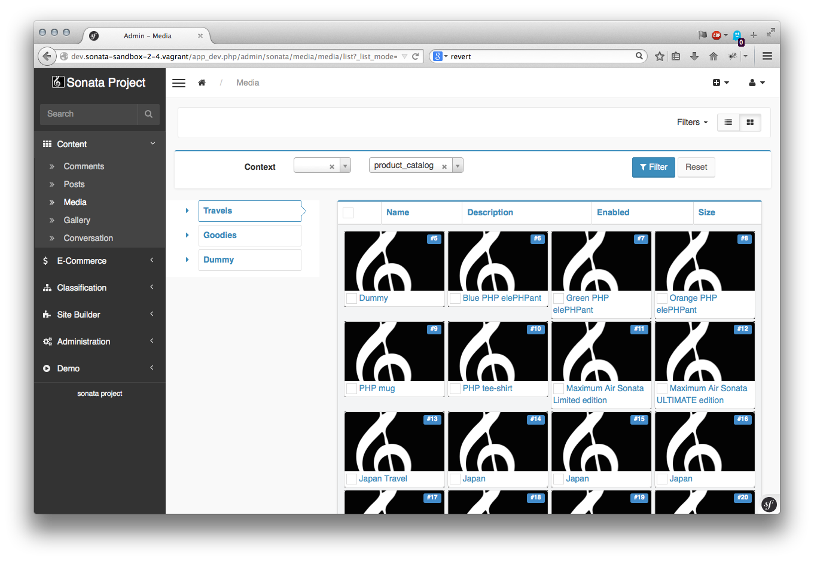
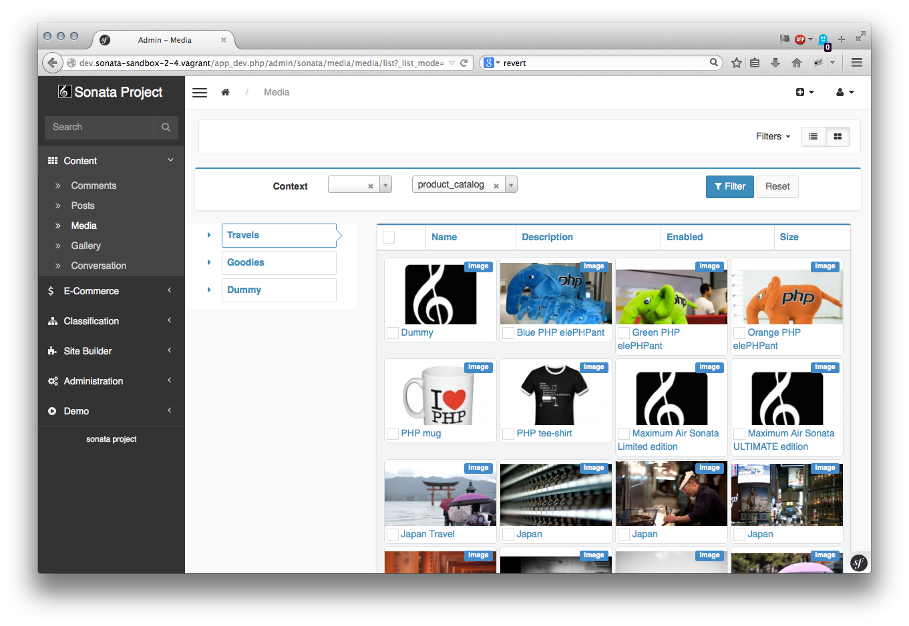

Customizing a mosaic list
=========================

.. versionadded:: 3.0

   Since 3.0, the AdminBundle includes a mosaic list mode in order to have a more visual representation.

It is possible to configure the default view by creating a dedicated template.

.. note::

   If you want to change the default mosaic background globally,
   please use the following configuration:

    .. code-block:: yaml

        # config/packages/sonata_admin.yaml

        sonata_admin:
            # ...
            options:
                # ...
                mosaic_background: '/path/to/image.png' # or use base64

First, configure the ``outer_list_rows_mosaic`` template key:

.. code-block:: xml

      <!-- config/services.xml -->

       <service id="sonata.media.admin.media" class="%sonata.media.admin.media.class%">
            <argument/>
            <argument>%sonata.media.admin.media.entity%</argument>
            <argument>%sonata.media.admin.media.controller%</argument>
            <tag
                name="sonata.admin.template_registry"
                template_name="outer_list_rows_mosaic"
                template_path="@SonataMedia/MediaAdmin/list_outer_rows_mosaic.html.twig"
                />
            <tag
                name="sonata.admin"
                manager_type="orm"
                group="sonata_media"
                label_catalogue="%sonata.media.admin.media.translation_domain%"
                label="media"
                label_translator_strategy="sonata.admin.label.strategy.underscore"
                />
       </service>

The ``list_outer_rows_mosaic.html.twig`` is the name of one mosaic's tile. You should also extends the template and overwrite the default blocks availables.

.. code-block:: jinja

    

    {{ meta.image }}

    
        {{ object.providerName|trans({}, 'SonataMediaBundle') }}
    

    
        {{ object.providerName|trans({}, 'SonataMediaBundle') }}

         {{ object.width }}x{{ object.height }}px
        
            ({{ object.length }})
        

         

        
           {{ object.authorname }}
        

        
            ~
        

        
            &copy; {{ object.copyright }}
        
    

    
        
            <a href="{{ admin.generateUrl('edit', {'id' : object|sonata_urlsafeid(admin) }) }}">{{ meta.title|u.truncate(40) }}</a>
        
            <a href="{{ admin.generateUrl('show', {'id' : object|sonata_urlsafeid(admin) }) }}">{{ meta.title|u.truncate(40) }}</a>
        
            {{ meta.title|u.truncate(40) }}
        
    

Block types
-----------

 - ``sonata_mosaic_background``: this block is the background value defined in the ObjectMetadata object.
 - ``sonata_mosaic_default_view``: this block is used when the list is displayed.
 - ``sonata_mosaic_hover_view``: this block is used when the mouse is over the tile.
 - ``sonata_mosaic_description``: this block will be always on screen and should represent the entity's name.

The ``ObjectMetadata`` object is returned by the related admin class, and can be
used to define which image field from the entity will be displayed if available.
For instance, the SonataMediaBundle defines the method as::

    final class MediaAdmin extends AbstractAdmin
    {
        public function getObjectMetadata($object)
        {
            $provider = $this->pool->getProvider($object->getProviderName());

            $url = $provider->generatePublicUrl($object, $provider->getFormatName($object, 'admin'));

            return new Metadata($object->getName(), $object->getDescription(), $url);
        }
    }

.. note::

    In your own admin, ``media`` is a field and not the ``$object``. Therefore,
    the code above must be updated this way::

        public function getObjectMetadata($object): Metadata
        {
            $media = $object->getMediaField();

            $provider = $this->pool->getProvider($media->getProviderName());

            $url = $provider->generatePublicUrl($media, $provider->getFormatName($media, 'admin'));

            return new Metadata($media->getName(), $media->getDescription(), $url);
        }

You will also have to use dependency injection. For this, first define
the ``$pool`` variable and override the constructor::

    use Sonata\MediaBundle\Provider\Pool;

    private $pool;

    public function __construct(string $code, string $class, string $baseControllerName, Pool $pool)
    {
       $this->pool = $pool;

       parent::__construct($code, $class, $baseControllerName);
    }

Then add ``'@sonata.media.pool'`` to your service definition arguments:

.. code-block:: yaml

    # config/services.yaml

    services:
        app.admin.post:
            class: App\Admin\PostAdmin
            arguments:
                - ~
                - App\Entity\Post
                - ~
                - '@sonata.media.pool'
            tags:
                -
                    name: sonata.admin
                    manager_type: orm
                    group: 'Content'
                    label: 'Post'

The final view will look like:

