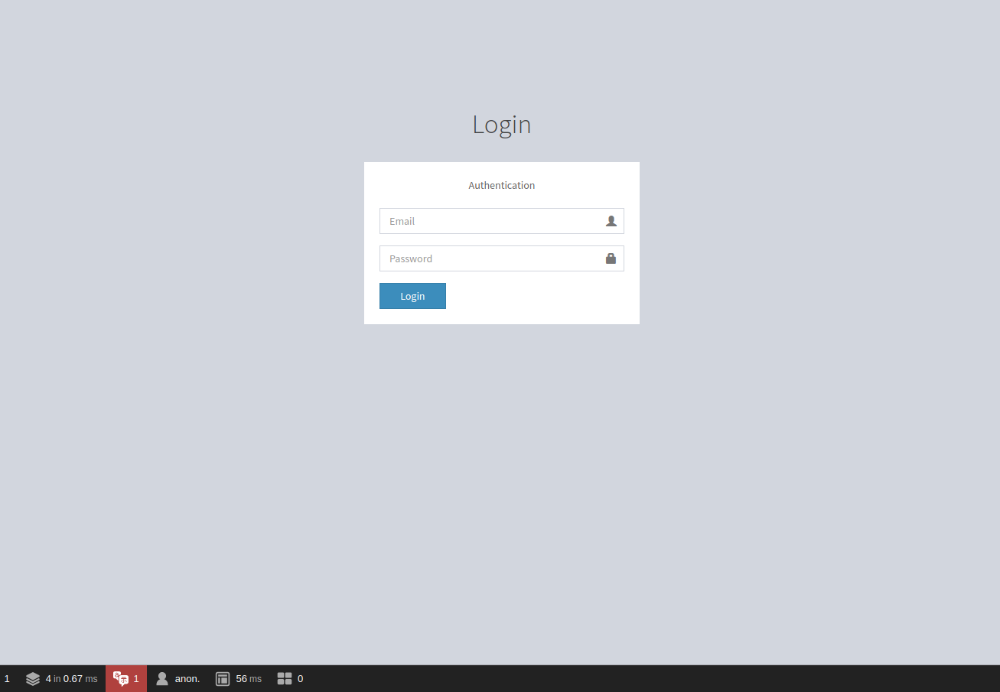

SonataAdmin without FOSUserBundle/SonataUserBundle
==================================================

Here we will explain how you can use SonataAdmin with Symfony Guard instead
of using FOSUserBundle or SonataUserBundle.

Code used in this short guide can be found `here <https://github.com/kunicmarko20/guard-talk-example>`__
with support for different Symfony versions.

The recipe
----------

Things we will need to setup:

- `User Entity <#user-entity>`__
- `UserProvider <#userprovider>`__
- `AdminLoginForm <#adminloginform>`__
- `AdminLoginAuthenticator <#adminloginauthenticator>`__
- `AdminLoginController <#adminlogincontroller>`__
- `Setup firewall in security.yaml <#setup-firewall-in-security-yaml>`__
- `Login template resembling Sonata style <#login-template-resembling-sonata-style>`__

User Entity
^^^^^^^^^^^

This represents your security user, you can read more about it
`here <http://symfony.com/doc/current/security/entity_provider.html#create-your-user-entity>`__::

    namespace App\Entity;

    use Doctrine\ORM\Mapping as ORM;
    use Symfony\Component\Security\Core\User\UserInterface;

    /**
     * @ORM\Entity
     */
    class User implements UserInterface
    {
        /**
         * @ORM\Id
         * @ORM\Column(type="integer")
         * @ORM\GeneratedValue(strategy="AUTO")
         */
        private $id;

        /**
         * @ORM\Column(name="email", type="string", unique=true)
         */
        private $email;

        /**
         * @ORM\Column(name="password", type="string", nullable=true)
         */
        private $password;

        /**
         * @ORM\Column(name="roles", type="json_array")
         */
        private $roles;
    }

UserProvider
^^^^^^^^^^^^

This represents your user provider, it will be used to load your security users, read
more about it `here <http://symfony.com/doc/current/security/custom_provider.html#create-a-user-provider>`__::

    namespace App\Security;

    use App\Entity\User;
    use Doctrine\ORM\EntityManagerInterface;
    use Symfony\Component\Security\Core\User\UserInterface;
    use Symfony\Component\Security\Core\User\UserProviderInterface;
    use Symfony\Component\Security\Core\Exception\UsernameNotFoundException;

    final class UserProvider implements UserProviderInterface
    {
        /**
         * @var EntityManagerInterface
         */
        private $entityManager;

        public function __construct(EntityManagerInterface $entityManager)
        {
            $this->entityManager = $entityManager;
        }

        public function loadUserByUsername($email): User
        {
            $user = $this->findOneUserBy(['email' => $email]);

            if (!$user) {
                throw new UsernameNotFoundException(
                    sprintf(
                        'User with "%s" email does not exist.',
                        $email
                    )
                );
            }

            return $user;
        }

        private function findOneUserBy(array $options): ?User
        {
            return $this->entityManager
                ->getRepository(User::class)
                ->findOneBy($options);
        }

        public function refreshUser(UserInterface $user): User
        {
            assert($user instanceof User);

            if (null === $reloadedUser = $this->findOneUserBy(['id' => $user->getId()])) {
                throw new UsernameNotFoundException(sprintf(
                    'User with ID "%s" could not be reloaded.',
                    $user->getId()
                ));
            }

            return $reloadedUser;
        }

        public function supportsClass($class): bool
        {
            return $class === User::class;
        }
    }

AdminLoginForm
^^^^^^^^^^^^^^

A small login form that will validate our data::

    namespace App\Form;

    use Symfony\Component\Form\AbstractType;
    use Symfony\Component\Form\Extension\Core\Type\EmailType;
    use Symfony\Component\Form\FormBuilderInterface;
    use Symfony\Component\Form\Extension\Core\Type\PasswordType;

    final class AdminLoginForm extends AbstractType
    {
        public function buildForm(FormBuilderInterface $builder, array $options): void
        {
            $builder
                ->add('email', EmailType::class)
                ->add('password', PasswordType::class);
        }
    }

AdminLoginAuthenticator
^^^^^^^^^^^^^^^^^^^^^^^

This represents your custom authentication system, read
more about it `here <https://symfony.com/doc/current/security/guard_authentication.html#step-1-create-the-authenticator-class>`__::

    namespace App\Security;

    use App\Form\AdminLoginForm;
    use App\Entity\User;
    use Symfony\Component\Form\FormFactoryInterface;
    use Symfony\Component\HttpFoundation\RedirectResponse;
    use Symfony\Component\HttpFoundation\Request;
    use Symfony\Component\HttpFoundation\Response;
    use Symfony\Component\Routing\RouterInterface;
    use Symfony\Component\Security\Core\Authentication\Token\TokenInterface;
    use Symfony\Component\Security\Core\Encoder\UserPasswordEncoderInterface;
    use Symfony\Component\Security\Core\Exception\AuthenticationException;
    use Symfony\Component\Security\Core\Security;
    use Symfony\Component\Security\Core\User\UserInterface;
    use Symfony\Component\Security\Core\User\UserProviderInterface;
    use Symfony\Component\Security\Guard\Authenticator\AbstractFormLoginAuthenticator;
    use Symfony\Component\Security\Guard\AuthenticatorInterface;

    final class AdminLoginAuthenticator extends AbstractFormLoginAuthenticator implements AuthenticatorInterface
    {
        /**
         * @var FormFactoryInterface
         */
        private $formFactory;

        /**
         * @var RouterInterface
         */
        private $router;

        /**
         * @var UserPasswordEncoderInterface
         */
        private $passwordEncoder;

        public function __construct(
            FormFactoryInterface $formFactory,
            RouterInterface $router,
            UserPasswordEncoderInterface $passwordEncoder
        ) {
            $this->formFactory = $formFactory;
            $this->router = $router;
            $this->passwordEncoder = $passwordEncoder;
        }

        public function supports(Request $request): bool
        {
            if ($request->getPathInfo() != '/admin/login' || $request->getMethod() != 'POST') {
                return false;
            }

            return true;
        }

        public function getCredentials(Request $request): array
        {
            $form = $this->formFactory->create(AdminLoginForm::class);
            $form->handleRequest($request);

            $data = $form->getData();
            $request->getSession()->set(
                Security::LAST_USERNAME,
                $data['email']
            );

            return $data;
        }

        public function getUser($credentials, UserProviderInterface $userProvider): UserInterface
        {
            return $userProvider->loadUserByUsername($credentials['email']);
        }

        public function checkCredentials($credentials, UserInterface $user): bool
        {
            return $this->passwordEncoder->isPasswordValid($user, $credentials['password']);
        }

        public function onAuthenticationFailure(Request $request, AuthenticationException $exception): RedirectResponse
        {
            $request->getSession()->set(Security::AUTHENTICATION_ERROR, $exception);

            return new RedirectResponse($this->router->generate('admin_login'));
        }

        protected function getLoginUrl(): RedirectResponse
        {
            return new RedirectResponse($this->router->generate('admin_login'));
        }

        public function onAuthenticationSuccess(Request $request, TokenInterface $token, $providerKey): RedirectResponse
        {
            return new RedirectResponse($this->router->generate('sonata_admin_dashboard'));
        }
    }

AdminLoginController
^^^^^^^^^^^^^^^^^^^^

A Controller, used to render login form. Logout is left empty intentionally because
this will be handled by Symfony, but we still need to register that route::

    namespace App\Controller;

    use Symfony\Bundle\FrameworkBundle\Controller\AbstractController;
    use App\Form\AdminLoginForm;
    use Symfony\Component\Routing\Annotation\Route;
    use Symfony\Component\Security\Http\Authentication\AuthenticationUtils;
    use Symfony\Component\HttpFoundation\Response;

    final class AdminLoginController extends AbstractController
    {
        /**
         * @var AuthenticationUtils
         */
        private $authenticationUtils;

        public function __construct(AuthenticationUtils $authenticationUtils)
        {
            $this->authenticationUtils = $authenticationUtils;
        }

        /**
         * @Route("/admin/login", name="admin_login")
         */
        public function loginAction(): Response
        {
            $form = $this->createForm(AdminLoginForm::class, [
                'email' => $this->authenticationUtils->getLastUsername()
            ]);

            return $this->render('security/login.html.twig', [
                'last_username' => $this->authenticationUtils->getLastUsername(),
                'form' => $form->createView(),
                'error' => $this->authenticationUtils->getLastAuthenticationError(),
            ]);
        }

        /**
         * @Route("/admin/logout", name="admin_logout")
         */
        public function logoutAction(): void
        {
            // Left empty intentionally because this will be handled by Symfony.
        }
    }

Setup firewall in `security.yaml`
^^^^^^^^^^^^^^^^^^^^^^^^^^^^^^^^^

.. code-block:: yaml

    # config/packages/security.yaml

    security:
        role_hierarchy:
            ROLE_ADMIN:       [ROLE_USER, ROLE_SONATA_ADMIN]
            ROLE_SUPER_ADMIN: [ROLE_ADMIN, ROLE_ALLOWED_TO_SWITCH]
            SONATA:
                - ROLE_SONATA_PAGE_ADMIN_PAGE_EDIT

        encoders:
            App\Entity\User: auto # use bcrypt if you are using "symfony/security-bundle" < 4.3

        providers:
            users:
                id: App\Security\UserProvider

        firewalls:
            # Disabling the security for the web debug toolbar, the profiler and Assetic.
            dev:
                pattern:  ^/(_(profiler|wdt)|css|images|js)/
                security: false
            # -> custom firewall for the admin area of the URL
            admin:
                pattern:            /admin(.*)
                form_login:
                    provider:       users
                    login_path:     admin_login
                    use_forward:    false
                    check_path:     admin_login
                    failure_path:   null
                logout:
                    path:           admin_logout
                    target:         admin_login
                anonymous:          true
                guard:
                    authenticators:
                        - App\Security\AdminLoginAuthenticator
            main:
                anonymous: ~

    access_control:
        - { path: ^/admin/login$, role: IS_AUTHENTICATED_ANONYMOUSLY }
        - { path: ^/admin/logout$, role: IS_AUTHENTICATED_ANONYMOUSLY }
        - { path: ^/admin/, role: [ROLE_ADMIN, ROLE_SONATA_ADMIN] }
        - { path: ^/.*, role: IS_AUTHENTICATED_ANONYMOUSLY }

Login template resembling Sonata style
^^^^^^^^^^^^^^^^^^^^^^^^^^^^^^^^^^^^^^

.. code-block:: html+jinja

    {# templates/security/login.html.twig #}

    

    
    

    
    

    
    

    class="sonata-bc login-page"

    
        

            

                <a href="{{ path('sonata_admin_dashboard') }}">
                    Login
                </a>
            

            

                
                    
                        
                            

                                {{ error.messageKey|trans(error.messageData, 'security') }}
                            

                        
                    
                    
                        
                            

                                {{ flash }}
                            

                        
                    
                    
{{ 'Authentication'|trans }}

                    <form action="{{ path("admin_login") }}" method="post" role="form">
                        {{ form_row(form._token) }}

                        

                            <input type="text" class="form-control" id="username" name="{{ form.email.vars.full_name }}" value="{{ last_username }}" required="required" placeholder="Email"/>
                            
                        

                        

                            <input type="password" class="form-control" id="password" name="{{ form.password.vars.full_name }}" required="required" placeholder="Password"/>
                            
                        

                        

                            

                                <button type="submit" class="btn btn-primary btn-block btn-flat">Login</button>
                            

                        

                    </form>
                
            

        

    

The login form will look like this:

