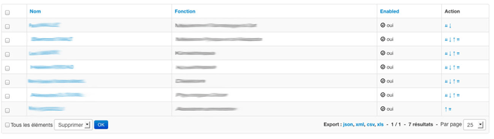

Sortable behavior in admin listing
==================================

This is a full working example of how to implement a sortable feature in your Sonata admin listing

.. note::

   This article assumes you are using Symfony 4. Using Symfony 2.8 or 3
    will require to slightly modify some namespaces and paths when creating
    entities and admins.

Background
----------

A sortable behavior is already available for one-to-many relationships (https://sonata-project.org/bundles/doctrine-orm-admin/master/doc/reference/form_field_definition.html#advanced-usage-one-to-many).
However there is no packaged solution to have some up and down arrows to sort
your records such as showed in the following screen

Pre-requisites
--------------

Configuration
^^^^^^^^^^^^^
- you already have SonataAdmin and DoctrineORM up and running
- you already have an Entity class for which you want to implement a sortable feature. For the purpose of the example we are going to call it ``Client``.
- you already have an Admin set up, in this example we will call it ``ClientAdmin``

Bundles
^^^^^^^
- install ``gedmo/doctrine-extensions`` bundle in your project (check ``stof/doctrine-extensions-bundle`` for easier integration in your project) and enable the sortable feature in your config
- install ``pixassociates/sortable-behavior-bundle`` at least version ^1.1 in your project

The recipe
----------

First of all we are going to add a position field in our ``Client`` entity::

    /**
     * @Gedmo\SortablePosition
     * @ORM\Column(name="position", type="integer")
     */
    private $position;

Then we need to inject the Sortable listener. If you only have the Gedmo bundle enabled, you only have to add the listener to your config.yml and skip this step.

.. code-block:: yaml

    # config/services.yaml

    services:
        gedmo.listener.sortable:
            class: Gedmo\Sortable\SortableListener
            calls:
                - [setAnnotationReader, ['@annotation_reader']]
            tags:
                - { name: doctrine.event_subscriber, connection: default }

If you have the ``stof/doctrine-extensions-bundle``, you only need to enable the sortable
feature in your config.yml such as

.. code-block:: yaml

    # config/packages/stof_doctrine_extensions.yaml

    stof_doctrine_extensions:
        orm:
            default:
                sortable: true

In our ``ClientAdmin`` we are going to add a custom action in the ``configureListFields`` method
and use the default twig template provided in the ``pixSortableBehaviorBundle``::

    $listMapper
        ->add('_action', null, [
            'actions' => [
                'move' => [
                    'template' => '@PixSortableBehavior/Default/_sort.html.twig'
                ],
            ]
        ]);

In order to add new routes for these actions we are also adding the following method::

    // src/Admin/ClientAdmin.php

    namespace App/Admin;

    use Sonata\AdminBundle\Route\RouteCollection;
    // ...

    protected function configureRoutes(RouteCollection $collection)
    {
        // ...
        $collection->add('move', $this->getRouterIdParameter().'/move/{position}');
    }

Now you can update your ``services.yaml`` to use the handler provided by the ``pixSortableBehaviorBundle``

.. code-block:: yaml

    # config/services.yaml

    services:
        app.admin.client:
            class: App\Admin\ClientAdmin
            arguments:
                - ~
                - App\Entity\Client
                - 'PixSortableBehaviorBundle:SortableAdmin' # define the new controller via the third argument
            tags:
                - { name: sonata.admin, manager_type: orm, label: 'Clients' }

Now we need to define the sort by field to be ``$position``::

    // src/Admin/ClientAdmin.php

    namespace App\Admin;

    use Sonata\AdminBundle\AbstractAdmin;
    use Sonata\AdminBundle\Datagrid\ListMapper;
    use Sonata\AdminBundle\Route\RouteCollection;

    class ClientAdmin extends AbstractAdmin
    {
        protected $datagridValues = [
            '_page' => 1,
            '_sort_order' => 'ASC',
            '_sort_by' => 'position',
        ];

        protected function configureRoutes(RouteCollection $collection)
        {
            // ...
            $collection->add('move', $this->getRouterIdParameter().'/move/{position}');
        }

        // ...

        protected function configureListFields(ListMapper $listMapper)
        {
            $listMapper
                ->addIdentifier('name')
                ->add('enabled')
                ->add('_action', null, [
                    'actions' => [
                        'move' => [
                            'template' => '@App/Admin/_sort.html.twig'
                        ],
                    ],
                ])
            ;
        }
    }

Further work
------------

* handle ajax request
* interface for SonataAdminBundle
