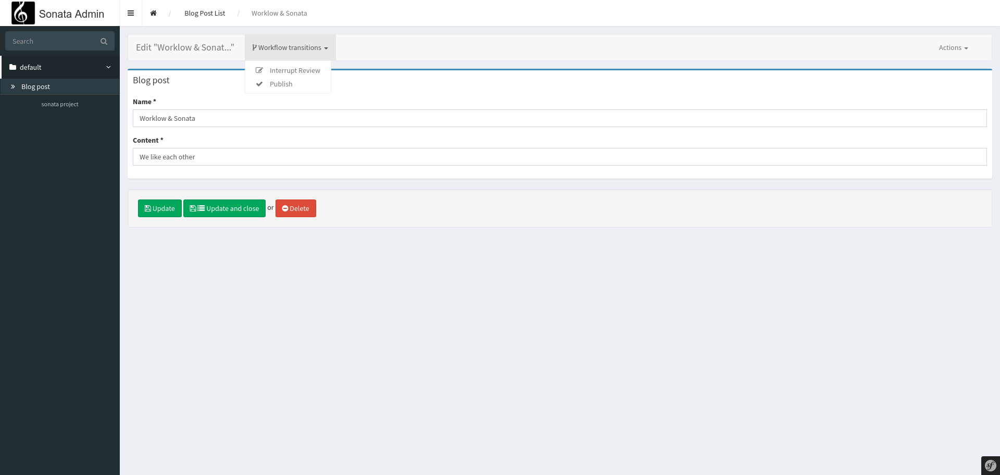

Integrate Symfony Workflow Component
====================================

If you are using Symfony `Workflow Component`_ and if you wish to use it with Sonata,
there is a 3rd party library that provides toolkit classes.

Download the Bundle
-------------------

.. code-block:: bash

    composer require yokai/sonata-workflow

Usage
-----

Let's say we have a ``BlogPost`` entity that is under a Symfony workflow:

.. code-block:: yaml

   # config/packages/workflow.yaml

   framework:
       workflows:
           blog_post:
               type: state_machine
               marking_store:
                   type: single_state
                   arguments:
                       - status
               supports:
                   - App\Entity\BlogPost
               places:
                   - draft
                   - pending_review
                   - pending_update
                   - published
               initial_place: draft
               transitions:
                   start_review:
                       from: draft
                       to:   pending_review
                   interrupt_review:
                       from: pending_review
                       to:   pending_update
                   restart_review:
                       from: pending_update
                       to:   pending_review
                   publish:
                       from: pending_review
                       to:   published

You can use the provided extension to take care of your entity admin.

.. code-block:: yaml

   # config/packages/sonata_admin.yaml

   services:
       app.admin.blog_post:
           class: App\Admin\BlogPostAdmin
           arguments:
               - ~
               - App\Entity\BlogPost
               - Yokai\SonataWorkflow\Controller\WorkflowController
           tags:
               - { name: sonata.admin, manager_type: orm }

       app.admin.extension.workflow.blog_post:
           class: Yokai\SonataWorkflow\Admin\Extension\WorkflowExtension
           arguments:
               - '@workflow.registry'
               - transitions_icons:
                     start_review: fas fa-question
                     interrupt_review: fas fa-edit
                     restart_review: fas fa-question
                     publish: fas fa-check

.. code-block:: yaml

   # config/packages/sonata_admin.yaml

   sonata_admin:
       extensions:
           admin.extension.workflow.blog_post:
               admins:
                   - app.admin.blog_post

You are all set. If you visit your admin page in edit or show mode,
you will see something like this:

.. _`Workflow Component`: https://symfony.com/doc/4.4/components/workflow.html
