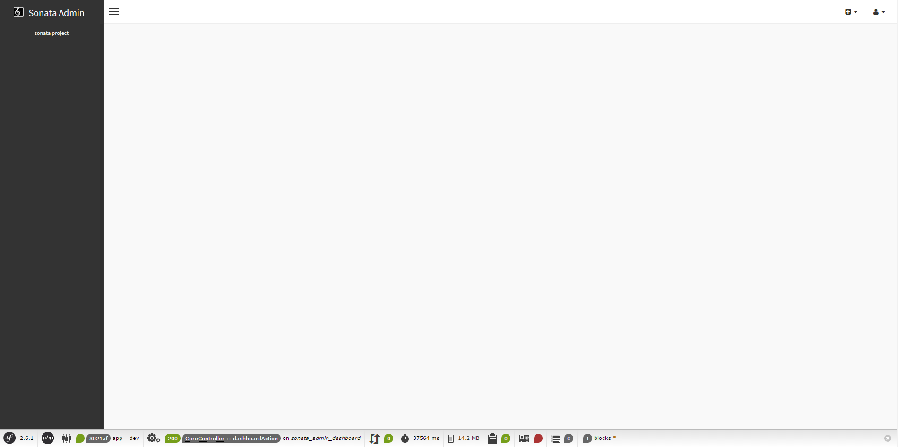

Installation
============

SonataAdminBundle is just a bundle and as such, you can install it at any
moment during a project's lifecycle.

Download the Bundle
-------------------

Open a command console, enter your project directory and execute the
following command to download the latest stable version of this bundle:

.. code-block:: bash

    $ composer require sonata-project/admin-bundle

This command requires you to have Composer installed globally, as explained in
the `installation chapter`_ of the Composer documentation.

Download a Storage Bundle
-------------------------

You've now downloaded the SonataAdminBundle. While this bundle contains all
functionality, it needs storage bundles to be able to communicate with a
database. Before using the SonataAdminBundle, you have to download one of these
storage bundles. The official storage bundles are:

* `SonataDoctrineORMAdminBundle`_ (integrates the Doctrine ORM);
* `SonataDoctrineMongoDBAdminBundle`_ (integrates the Doctrine MongoDB ODM);
* `SonataDoctrinePhpcrAdminBundle`_ (integrates the Doctrine PHPCR ODM).

You can download them in the same way as the SonataAdminBundle. Please, choose one
and follow its installation instructions before proceeding.

.. note::

    Don't know which to choose? Most new users prefer SonataDoctrineORMAdmin,
    to interact with traditional relational databases (MySQL, PostgreSQL, etc).

Enable the Bundle
-----------------

Then, enable the bundle and the bundles it relies on by adding the following
line in `bundles.php` file of your project:

.. code-block:: php

    <?php

    // config/bundles.php

    return [
        //...
        Symfony\Bundle\SecurityBundle\SecurityBundle::class => ['all' => true],
        Sonata\CoreBundle\SonataCoreBundle::class => ['all' => true],
        Sonata\BlockBundle\SonataBlockBundle::class => ['all' => true],
        Knp\Bundle\MenuBundle\KnpMenuBundle::class => ['all' => true],
        Sonata\AdminBundle\SonataAdminBundle::class => ['all' => true],
    ];

.. note::

    If you are not using Symfony Flex, you should enable bundles in your
    ``AppKernel.php``.

.. code-block:: php

    // app/AppKernel.php

    // ...
    class AppKernel extends Kernel
    {
        public function registerBundles()
        {
            $bundles = [
                // ...

                // The admin requires some twig functions defined in the security
                // bundle, like is_granted. Register this bundle if it wasn't the case
                // already.
                new Symfony\Bundle\SecurityBundle\SecurityBundle(),

                // These are the other bundles the SonataAdminBundle relies on
                new Sonata\CoreBundle\SonataCoreBundle(),
                new Sonata\BlockBundle\SonataBlockBundle(),
                new Knp\Bundle\MenuBundle\KnpMenuBundle(),

                // And finally
                new Sonata\AdminBundle\SonataAdminBundle(),
            ];

            // ...
        }

        // ...
    }

.. note::

    If a bundle is already registered, you should not register it again.

Configure the Installed Bundles
-------------------------------

Now all needed bundles are downloaded and registered, you have to add some
configuration. The admin interface is using SonataBlockBundle to put everything
in blocks. You just have to tell the block bundle about the existence of the
admin block:

.. configuration-block::

    .. code-block:: yaml

        # config/packages/sonata_admin.yaml
        sonata_block:
            blocks:
                # enable the SonataAdminBundle block
                sonata.admin.block.admin_list:
                    contexts: [admin]

                # ...
.. note::

    If you are not using Symfony Flex, this should be added to ``app/config/config.yml``.

.. note::

    Don't worry too much if, at this point, you don't yet understand fully
    what a block is. The SonataBlockBundle is a useful tool, but it's not vital
    that you understand it in order to use the admin bundle.

Enable the "translator" service
-------------------------------

The translator service is required by SonataAdmin to display all labels properly.
For more information: http://symfony.com/doc/current/translation.html#configuration

.. configuration-block::

    .. code-block:: yaml

        # config/packages/framework.yaml
        framework:
                translator: { fallbacks: ["%locale%"] }

.. note::

    If you are not using Symfony Flex, this should be added to ``app/config/config.yml``.

Define routes
-------------

The bundles are now registered and configured correctly. To be able to access SonataAdminBundle's pages,
the Symfony router needs to know the routes provided by the SonataAdminBundle.
You can do this by adding its routes to your application's routing file:

.. configuration-block::

    .. code-block:: yaml

        # config/routes/sonata_admin.yaml

        admin_area:
            resource: '@SonataAdminBundle/Resources/config/routing/sonata_admin.xml'
            prefix: /admin

        _sonata_admin:
            resource: .
            type: sonata_admin
            prefix: /admin

.. note::

    If you are not using Symfony Flex, routes should be added to ``app/config/routing.yml``.

.. note::

    If you're using XML or PHP to specify your application's configuration,
    the above routing configuration must be placed in routing.xml or
    routing.php according to your format (i.e. XML or PHP).

.. note::

    For those curious about the ``resource: .`` setting: it is unusual syntax but used
    because Symfony requires a resource to be defined (which points to a real file).
    Once this validation passes Sonata's ``AdminPoolLoader`` is in charge of processing
    this route and it simply ignores the resource setting.

At this point you can already access the (empty) admin dashboard by visiting the URL:
``http://yoursite.local/admin/dashboard``.

Preparing your Environment
--------------------------

As with all bundles you install, it's a good practice to clear the cache and
install the assets:

.. code-block:: bash

    $ bin/console cache:clear
    $ bin/console assets:install

The Admin Interface
-------------------

You've finished the installation process, congratulations. If you fire up the
server, you can now visit the admin page on http://localhost:8000/admin

.. note::

    This tutorial assumes you are using the build-in server using the
    ``bin/console server:start`` (or ``server:run``) command.

As you can see, the admin panel is very empty. This is because no bundle has
provided admin functionality for the admin bundle yet. Fortunately, you'll
learn how to do this in the :doc:`next chapter <creating_an_admin>`.

.. _`installation chapter`: https://getcomposer.org/doc/00-intro.md
.. _SonataDoctrineORMAdminBundle: http://sonata-project.org/bundles/doctrine-orm-admin/master/doc/index.html
.. _SonataDoctrineMongoDBAdminBundle: http://sonata-project.org/bundles/mongo-admin/master/doc/index.html
.. _SonataDoctrinePhpcrAdminBundle: http://sonata-project.org/bundles/doctrine-phpcr-admin/master/doc/index.html
