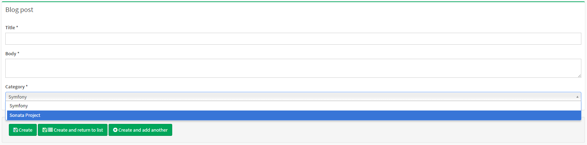
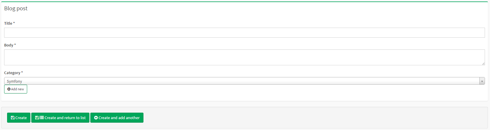
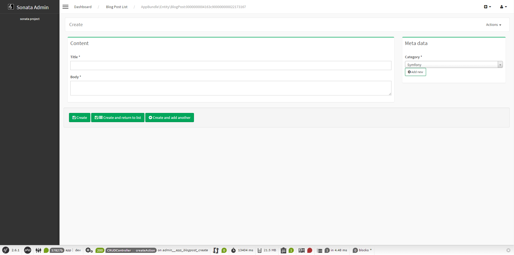

The Form View
=============

You've seen the absolute top of the iceberg in
:doc:`the previous chapter <creating_an_admin>`. But there is a lot more to
discover! In the coming chapters, you'll create an Admin class for the more
complex ``BlogPost`` model. Meanwhile, you'll learn how to make things a bit
more pretty.

.. note::
    This article assumes you are using Symfony 4. Using Symfony 2.8 or 3
    will require to slightly modify some namespaces and paths when creating
    entities and admins.

Bootstrapping the Admin Class
-----------------------------

The basic class definition will look the same as the ``CategoryAdmin``:

.. code-block:: php

    // src/Admin/BlogPostAdmin.php
    namespace App\Admin;

    use Sonata\AdminBundle\Admin\AbstractAdmin;
    use Sonata\AdminBundle\Datagrid\ListMapper;
    use Sonata\AdminBundle\Form\FormMapper;

    class BlogPostAdmin extends AbstractAdmin
    {
        protected function configureFormFields(FormMapper $formMapper)
        {
            // ... configure $formMapper
        }

        protected function configureListFields(ListMapper $listMapper)
        {
            // ... configure $listMapper
        }
    }

The same applies to the service definition:

.. code-block:: yaml

    # app/config/services.yml

    services:
        # ...
        admin.blog_post:
            class: App\Admin\BlogPostAdmin
            arguments: [~, App\Entity\BlogPost, ~]
            tags:
                - { name: sonata.admin, manager_type: orm, label: Blog post }

Configuring the Form Mapper
---------------------------

If you already know the `Symfony Form component`_, the ``FormMapper`` will look
very similar.

You use the ``add()`` method to add fields to the form. The first argument is
the name of the property the field value maps to, the second argument is the
type of the field (see the `field type reference`_) and the third argument are
additional options to customize the form type. Only the first argument is
required as the Form component has type guessers to guess the type.

The ``BlogPost`` model has 4 properties: ``id``, ``title``, ``body``,
``category``. The ``id`` property's value is generated automatically by the
database. This means the form view just needs 3 fields: title, body and
category.

The title and body fields are simple ``TextType`` and ``TextareaType`` fields,
you can add them straight away:

.. code-block:: php

    // src/Admin/BlogPostAdmin.php

    use Symfony\Component\Form\Extension\Core\Type\TextType;
    use Symfony\Component\Form\Extension\Core\Type\TextareaType;

    // ...
    protected function configureFormFields(FormMapper $formMapper)
    {
        $formMapper
            ->add('title', TextType::class)
            ->add('body', TextareaType::class)
        ;
    }

However, the category field will reference another model. How can you solve that?

Adding Fields that Reference Other Models
-----------------------------------------

You have a couple different choices on how to add fields that reference other
models. The most basic choice is to use the ``EntityType`` provided by
the Doctrine Bridge. This will render a choice field with the available
entities as choice.

.. code-block:: php

    // src/Admin/BlogPostAdmin.php

    use App\Entity\Category;
    use Symfony\Bridge\Doctrine\Form\Type\EntityType;

    // ...
    protected function configureFormFields(FormMapper $formMapper)
    {
        $formMapper
            // ...
            ->add('category', EntityType::class, [
                'class' => Category::class,
                'choice_label' => 'name',
            ])
        ;
    }

As each blog post will only have one category, it renders as a select list:

When an admin would like to create a new category, they need to go to the
category admin page and create a new category.

Using the Sonata Model Type
~~~~~~~~~~~~~~~~~~~~~~~~~~~

To make life easier for admins, you can use the
:ref:`ModelType field <field-types-model>`. This field type will
also render as a choice field, but it includes a create button to open a
dialog with the admin of the referenced model in it:

.. code-block:: php

    // src/Admin/BlogPostAdmin.php

    use App\Entity\Category;
    use Sonata\AdminBundle\Form\Type\ModelType

    // ...
    protected function configureFormFields(FormMapper $formMapper)
    {
        $formMapper
            // ...
            ->add('category', ModelType::class, [
                'class' => Category::class,
                'property' => 'name',
            ])
        ;
    }

Using Groups
------------

Currently, everything is put into one block. Since the form only has three
fields, it is still usable, but it can become quite a mess pretty quick. To
solve this, the form mapper also supports grouping fields together.

For instance, the title and body fields can belong to the Content group and the
category field to a Meta data group. To do this, use the ``with()`` method:

.. code-block:: php

    // src/Admin/BlogPostAdmin.php

    use App\Entity\Category;
    use Sonata\AdminBundle\Form\Type\ModelType
    use Symfony\Component\Form\Extension\Core\Type\TextType;
    use Symfony\Component\Form\Extension\Core\Type\TextareaType;

    // ...
    protected function configureFormFields(FormMapper $formMapper)
    {
        $formMapper
            ->with('Content')
                ->add('title', TextType::class)
                ->add('body', TextareaType::class)
            ->end()

            ->with('Meta data')
                ->add('category', ModelType::class, [
                    'class' => Category::class,
                    'property' => 'name',
                ])
            ->end()
        ;
    }

The first argument is the name/label of the group and the second argument is an
array of options. For instance, you can pass HTML classes to the group in
order to tweak the styling:

.. code-block:: php

    // src/Admin/BlogPostAdmin.php

    // ...
    protected function configureFormFields(FormMapper $formMapper)
    {
        $formMapper
            ->with('Content', ['class' => 'col-md-9'])
                // ...
            ->end()
            ->with('Meta data', ['class' => 'col-md-3'])
                // ...
            ->end()
        ;
    }

This will now result in a much nicer edit page:

Using Tabs
~~~~~~~~~~

If you get even more options, you can also use multiple tabs by using the
``tab()`` shortcut method:

.. code-block:: php

    $formMapper
        ->tab('Post')
            ->with('Content', ...)
                // ...
            ->end()
            // ...
        ->end()

        ->tab('Publish Options')
            // ...
        ->end()
    ;

Creating a Blog Post
--------------------

You've now finished your nice form view for the ``BlogPost`` model. Now it's
time to test it out by creating a post.

After pressing the "Create" button, you probably see a green message like:
*Item "App\Entity\BlogPost:00000000192ba93c000000001b786396" has been
successfully created.*

While it's very friendly of the SonataAdminBundle to notify the admin of a
successful creation, the classname and some sort of hash aren't really nice to
read. This is the default string representation of an object in the
SonataAdminBundle. You can change it by defining a ``toString()`` method in the
Admin class. This receives the object to transform to a string as the first parameter:

.. note::
    No underscore prefix! ``toString()`` is correct!

.. code-block:: php

    // src/Admin/BlogPostAdmin.php

    // ...
    use App\Entity\BlogPost;

    class BlogPostAdmin extends AbstractAdmin
    {
        // ...

        public function toString($object)
        {
            return $object instanceof BlogPost
                ? $object->getTitle()
                : 'Blog Post'; // shown in the breadcrumb on the create view
        }
    }

Round Up
--------

In this tutorial, you've made your first contact with the greatest feature of
the SonataAdminBundle: Being able to customize literally everything. You've
started by creating a simple form and ended up with a nice edit page for your
admin.

In the :doc:`next chapter <the_list_view>`, you're going to look at the list
and datagrid actions.

.. _`Symfony Form component`: http://symfony.com/doc/current/book/forms.html
.. _`field type reference`: http://symfony.com/doc/current/reference/forms/types.html
.. _`entity field type`: http://symfony.com/doc/current/reference/forms/types/entity.html
.. _`choice_label`: http://symfony.com/doc/current/reference/forms/types/entity.html#choice-label
.. _`property`: http://symfony.com/doc/2.6/reference/forms/types/entity.html#property
