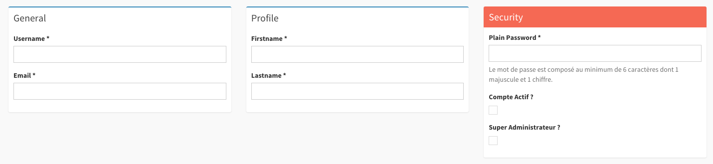

Creating and Editing objects
============================

This document will cover the Create and Edit actions. It will cover configuration
of the fields and forms available in these views and any other relevant settings.

.. note::

    This article assumes you are using Symfony 4. Using Symfony 2.8 or 3
    will require to slightly modify some namespaces and paths when creating
    entities and admins.

Basic configuration
-------------------

SonataAdmin Options that may affect the create or edit view:

.. code-block:: yaml

    # config/packages/sonata_admin.yaml

    sonata_admin:
        options:
            html5_validate:    true     # enable or disable html5 form validation
            confirm_exit:      true     # enable or disable a confirmation before navigating away
            js_debug:          false    # enable or disable to show javascript debug messages
            use_select2:       true     # enable or disable usage of the Select2 jQuery library
            use_icheck:        true     # enable or disable usage of the iCheck library
            use_bootlint:      false    # enable or disable usage of Bootlint
            use_stickyforms:   true     # enable or disable the floating buttons
            form_type:         standard # can also be 'horizontal'

        templates:
            edit:              '@SonataAdmin/CRUD/edit.html.twig'
            tab_menu_template: '@SonataAdmin/Core/tab_menu_template.html.twig'

For more information about optional libraries:

- Select2: https://github.com/select2/select2
- iCheck: http://icheck.fronteed.com/
- Bootlint: https://github.com/twbs/bootlint#in-the-browser

.. note::

    **TODO**:
    * options available when adding fields, inc custom templates

Routes
~~~~~~

You can disable creating or editing entities by removing the corresponding routes in your Admin.
For more detailed information about routes, see :doc:`routing`.

.. code-block:: php

    <?php
    // src/Admin/PersonAdmin.php

    final class PersonAdmin extends AbstractAdmin
    {
        // ...

        protected function configureRoutes(RouteCollection $collection): void
        {
            /* Removing the edit route will disable editing entities. It will also
            use the 'show' view as default link on the identifier columns in the list view. */
            $collection->remove('edit');

            /* Removing the create route will disable creating new entities. It will also
            remove the 'Add new' button in the list view. */
            $collection->remove('create');
        }

        // ...
    }

Adding form fields
------------------

Within the configureFormFields method you can define which fields should
be shown when editing or creating entities.
Each field has to be added to a specific form group. And form groups can
optionally be added to a tab. See `FormGroup options`_ for additional
information about configuring form groups.

Using the FormMapper add method, you can add form fields. The add method
has 4 parameters:

- ``name``: The name of your entity.
- ``type``: The type of field to show; by defaults this is ``null`` to let
  Sonata decide which type to use. See :doc:`Field Types <field_types>`
  for more information on available types.
- ``options``: The form options to be used for the field. These may differ
  per type. See :doc:`Field Types <field_types>` for more information on
  available options.
- ``fieldDescriptionOptions``: The field description options. Options here
  are passed through to the field template. See :ref:`Form Types, FieldDescription
  options <form_types_fielddescription_options>` for more information.

.. note::

    The property entered in ``name`` should be available in your Entity
    through getters/setters or public access.

.. code-block:: php

    <?php
    // src/Admin/PersonAdmin.php

    final class PersonAdmin extends AbstractAdmin
    {
        // ...

        protected function configureFormFields(FormMapper $formMapper): void
        {
            $formMapper
                ->tab('General') // The tab call is optional
                    ->with('Addresses')
                        ->add('title') // Add a field and let Sonata decide which type to use
                        ->add('streetname', TextType::class) // Add a textfield
                        ->add('housenumber', NumberType::class) // Add a number field
                        ->add('housenumberAddition', TextType::class, ['required' => false]) // Add a non-required text field
                    ->end() // End form group
                ->end() // End tab
            ;
        }

        // ...
    }

FormGroup options
~~~~~~~~~~~~~~~~~

When adding a form group to your edit/create form, you may specify some
options for the group itself.

- ``collapsed``: unused at the moment
- ``class``: The class for your form group in the admin; by default, the
  value is set to ``col-md-12``.
- ``fields``: The fields in your form group (you should NOT override this
  unless you know what you're doing).
- ``box_class``: The class for your form group box in the admin; by default,
  the value is set to ``box box-primary``.
- ``description``: A text shown at the top of the form group.
- ``translation_domain``: The translation domain for the form group title
  (the Admin translation domain is used by default).

To specify options, do as follows::

    // src/Admin/PersonAdmin.php

    final class PersonAdmin extends AbstractAdmin
    {
        // ...

        protected function configureFormFields(FormMapper $formMapper): void
        {
            $formMapper
                ->tab('General') // the tab call is optional
                    ->with('Addresses', [
                        'class'       => 'col-md-8',
                        'box_class'   => 'box box-solid box-danger',
                        'description' => 'Lorem ipsum',
                        // ...
                    ])
                        ->add('title')
                        // ...
                    ->end()
                ->end()
            ;
        }

        // ...
    }

Here is an example of what you can do with customizing the box_class on
a group:

Embedding other Admins
----------------------

.. note::

    **TODO**:
    * how to embed one Admin in another (1:1, 1:M, M:M)
    * how to access the right object(s) from the embedded Admin's code

Customizing just one of the actions
-----------------------------------

.. note::

    **TODO**:
    * how to create settings/fields that appear on just one of the create/edit views
    * and any controller changes needed to manage them
