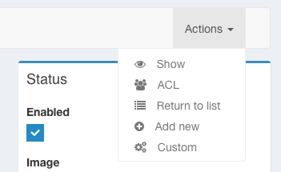

Advanced configuration
======================

.. note::

   This article assumes you are using Symfony 4. Using Symfony 2.8 or 3
    will require to slightly modify some namespaces and paths when creating
    entities and admins.

Service Configuration
---------------------

When you create a new Admin service you can configure its dependencies,
the services which are injected by default are:

=========================     ===================================================================
Dependencies                  Service ID
=========================     ===================================================================
model_manager                 sonata.admin.manager.%manager-type%
form_contractor               sonata.admin.builder.%manager-type%_form
show_builder                  sonata.admin.builder.%manager-type%_show
list_builder                  sonata.admin.builder.%manager-type%_list
datagrid_builder              sonata.admin.builder.%manager-type%_datagrid
translator                    translator
configuration_pool            sonata.admin.pool
router                        router
validator                     validator
security_handler              sonata.admin.security.handler
menu_factory                  knp_menu.factory
route_builder                 sonata.admin.route.path_info | sonata.admin.route.path_info_slashes
label_translator_strategy     sonata.admin.label.strategy.form_component
=========================     ===================================================================

.. note::

    ``%manager-type%`` is to be replaced by the manager type (orm, doctrine_mongodb...),
    and the default route_builder depends on it.

You have 2 ways of defining the dependencies inside your services config file
(``services.xml`` or ``services.yaml``):

* With a tag attribute, less verbose:

.. configuration-block::

    .. code-block:: xml

        <!-- config/services.xml -->

        <service id="app.admin.project" class="App\Admin\ProjectAdmin">
            <argument />
            <argument>App\Entity\Project</argument>
            <argument />
            <tag
                name="sonata.admin"
                manager_type="orm"
                group="Project"
                label="Project"
                label_translator_strategy="sonata.admin.label.strategy.native"
                route_builder="sonata.admin.route.path_info"
                />
        </service>

.. configuration-block::

    .. code-block:: yaml

        # config/services.yaml

        app.admin.project:
            class: App\Admin\ProjectAdmin
            arguments:
                - ~
                - App\Entity\Project
                - ~
            tags:
                -
                    name: sonata.admin
                    manager_type: orm
                    group: 'Project'
                    label: 'Project'
                    label_translator_strategy: 'sonata.admin.label.strategy.native'
                    route_builder: 'sonata.admin.route.path_info'

* With a method call, more verbose

.. configuration-block::

    .. code-block:: xml

        <!-- config/services.xml -->

        <service id="app.admin.project" class="App\Admin\ProjectAdmin">
            <argument />
            <argument>App\Entity\Project</argument>
            <argument />
            <call method="setLabelTranslatorStrategy">
                <argument type="service" id="sonata.admin.label.strategy.native" />
            </call>
            <call method="setRouteBuilder">
                <argument type="service" id="sonata.admin.route.path_info" />
            </call>
            <tag name="sonata.admin" manager_type="orm" group="Project" label="Project" />
        </service>

.. configuration-block::

    .. code-block:: yaml

        # config/services.yaml

        app.admin.project:
            class: App\Admin\ProjectAdmin
            arguments:
                - ~
                - App\Entity\Project
                - ~
            calls:
                - [setLabelTranslatorStrategy, ['@sonata.admin.label.strategy.native']]
                - [setRouteBuilder, ['@sonata.admin.route.path_info']]
            tags:
                - { name: sonata.admin, manager_type: orm, group: 'Project', label: 'Project' }

If you want to modify the service that is going to be injected, add the following code to your
application's config file:

.. configuration-block::

    .. code-block:: yaml

        # config/packages/sonata_admin.yaml

        admins:
            sonata_admin:
                sonata.order.admin.order:   # id of the admin service this setting is for
                    model_manager:          # dependency name, from the table above
                        sonata.order.admin.order.manager  # customised service id

Creating a custom RouteBuilder
^^^^^^^^^^^^^^^^^^^^^^^^^^^^^^

To create your own RouteBuilder create the PHP class and register it as a service::

    namespace App\Route;

    use Sonata\AdminBundle\Builder\RouteBuilderInterface;
    use Sonata\AdminBundle\Admin\AdminInterface;
    use Sonata\AdminBundle\Route\PathInfoBuilder;
    use Sonata\AdminBundle\Route\RouteCollection;

    class EntityRouterBuilder extends PathInfoBuilder implements RouteBuilderInterface
    {
        /**
         * @param AdminInterface  $admin
         * @param RouteCollection $collection
         */
        public function build(AdminInterface $admin, RouteCollection $collection)
        {
            parent::build($admin, $collection);

            $collection->add('yourSubAction');

            // The create button will disappear, delete functionality will be disabled as well
            // No more changes needed!
            $collection->remove('create');
            $collection->remove('delete');
        }
    }

.. configuration-block::

    .. code-block:: xml

        <!-- config/services.xml -->

        <service id="app.admin.entity_route_builder" class="App\Route\EntityRouterBuilder">
            <argument type="service" id="sonata.admin.audit.manager" />
        </service>

    .. code-block:: yaml

        # config/services.yaml

        services:
            app.admin.entity_route_builder:
                class: App\Route\EntityRouterBuilder
                arguments:
                    - "@sonata.admin.audit.manager"

Inherited classes
-----------------

You can manage inherited classes by injecting subclasses using the service configuration.

Lets consider a base class named `Person` and its subclasses `Student` and `Teacher`:

.. configuration-block::

    .. code-block:: xml

        <!-- config/services.xml -->

        <service id="app.admin.person" class="App\Admin\PersonAdmin">
            <argument/>
            <argument>App\Entity\Person</argument>
            <argument></argument>
            <call method="setSubClasses">
                <argument type="collection">
                    <argument key="student">App\Entity\Student</argument>
                    <argument key="teacher">App\Entity\Teacher</argument>
                </argument>
            </call>
            <tag name="sonata.admin" manager_type="orm" group="admin" label="Person" />
        </service>

You will just need to change the way forms are configured in order to
take into account these new subclasses::

    // src/Admin/PersonAdmin.php

    protected function configureFormFields(FormMapper $formMapper)
    {
        $subject = $this->getSubject();

        $formMapper
            ->add('name')
        ;

        if ($subject instanceof Teacher) {
            $formMapper->add('course', 'text');
        }
        elseif ($subject instanceof Student) {
            $formMapper->add('year', 'integer');
        }
    }

Tab Menu
--------

ACL
^^^

Though the route linked by a menu may be protected the Tab Menu will not automatically check the ACl for you.
The link will still appear unless you manually check it using the `hasAccess` method::

    protected function configureTabMenu(MenuItemInterface $menu, $action, AdminInterface $childAdmin = null)
    {
        // Link will always appear even if it is protected by ACL
        $menu->addChild($this->trans('Show'), [
            'uri' => $admin->generateUrl('show', ['id' => $id])
        ]);

        // Link will only appear if access to ACL protected URL is granted
        if ($this->hasAccess('edit')) {
            $menu->addChild($this->trans('Edit'), [
                'uri' => $admin->generateUrl('edit', ['id' => $id])
            ]);
        }
    }

Dropdowns
^^^^^^^^^

You can use dropdowns inside the Tab Menu by default. This can be achieved by using
the `'dropdown' => true` attribute::

    // src/Admin/PersonAdmin.php

    protected function configureTabMenu(MenuItemInterface $menu, $action, AdminInterface $childAdmin = null)
    {
        // other tab menu stuff ...

        $menu->addChild('comments', ['attributes' => ['dropdown' => true]]);

        $menu['comments']->addChild('list', [
            'uri' => $admin->generateUrl('listComment', ['id' => $id])
        ]);
        $menu['comments']->addChild('create', [
            'uri' => $admin->generateUrl('addComment', ['id' => $id])
        ]);
    }

If you want to use the Tab Menu in a different way, you can replace the Menu Template:

.. configuration-block::

    .. code-block:: yaml

        # config/packages/sonata_admin.yaml

        sonata_admin:
            templates:
                tab_menu_template:  "@App/Admin/own_tab_menu_template.html.twig"

Translations
^^^^^^^^^^^^

The translation parameters and domain can be customised by using the
``translation_domain`` and ``translation_parameters`` keys of the extra array
of data associated with the item, respectively::

    $menuItem->setExtras([
        'translation_parameters' => ['myparam' => 'myvalue'],
        'translation_domain' => 'My domain',
    ]);

You can also set the translation domain on the menu root, and children will
inherit it::

    $menu->setExtra('translation_domain', 'My domain');

Filter parameters
^^^^^^^^^^^^^^^^^

You can add or override filter parameters to the Tab Menu::

    use Knp\Menu\ItemInterface as MenuItemInterface;
    use Sonata\AdminBundle\Admin\AbstractAdmin;
    use Sonata\AdminBundle\Admin\AdminInterface;
    use Sonata\CoreBundle\Form\Type\EqualType;

    class DeliveryAdmin extends AbstractAdmin
    {
        protected function configureTabMenu(MenuItemInterface $menu, $action, AdminInterface $childAdmin = null)
        {
            if (!$childAdmin && !in_array($action, ['edit', 'show', 'list'])) {
                return;
            }

            if ($action == 'list') {
                // Get current filter parameters
                $filterParameters = $this->getFilterParameters();

                // Add or override filter parameters
                $filterParameters['status'] = [
                    'type'  => EqualType::TYPE_IS_EQUAL, // => 1
                    'value' => Delivery::STATUS_OPEN,
                ];

                // Add filters to uri of tab
                $menu->addChild('List open deliveries', [
                    'uri' => $this->generateUrl('list', ['filter' => $filterParameters])
                ]);

                return;
            }
        }
    }

The `Delivery` class is based on the `sonata_type_translatable_choice` example inside the `Core's documentation`_.

Actions Menu
------------

You can add custom items to the actions menu for a specific action by
overriding the following method::

    public function configureActionButtons(AdminInterface $admin, $list, $action, $object)
    {
        if (in_array($action, ['show', 'edit', 'acl']) && $object) {
            $list['custom'] = [
                'template' => '@App/Button/custom_button.html.twig',
            ];
        }

        // Remove history action
        unset($list['history']);

        return $list;
    }

Disable content stretching
--------------------------

You can disable ``html``, ``body`` and ``sidebar`` elements stretching.
These containers are forced to be full height by default. If you use
custom layout or just don't need such behavior, add ``no-stretch`` class
to the ``<html>`` tag.

.. code-block:: html+jinja

    {# templates/standard_layout.html.twig #}

    class="no-js no-stretch"

Custom Action Access Management
-------------------------------

You can customize the access system inside the CRUDController by adding
some entries inside the  `$accessMapping` array in the linked Admin.

.. code-block:: php

    <?php
    // src/Admin/PostAdmin.php

    class CustomAdmin extends AbstractAdmin
    {
        protected $accessMapping = [
            'myCustomFoo' => 'EDIT',
            'myCustomBar' => ['EDIT', 'LIST'],
        ];
    }

    <?php
    // src/Controller/CustomCRUDController.php

    class CustomCRUDController extends CRUDController
    {
        public function myCustomFooAction()
        {
            $this->admin->checkAccess('myCustomFoo');
            // If you can't access to EDIT role for the linked admin, an AccessDeniedException will be thrown

            // ...
        }

        public function myCustomBarAction($object)
        {
            $this->admin->checkAccess('myCustomBar', $object);
            // If you can't access to EDIT AND LIST roles for the linked admin, an AccessDeniedException will be thrown

            // ...
        }

        // ...
    }

You can also fully customize how you want to handle your access management
by simply overriding ``checkAccess`` function::

    <?php
    // src/Admin/CustomAdmin.php

    class CustomAdmin extends AbstractAdmin
    {
        public function checkAccess($action, $object = null)
        {
            $this->customAccessLogic();
        }

        // ...
    }

.. _`Core's documentation`: http://sonata-project.org/bundles/core/master/doc/reference/form_types.html#sonata-type-translatable-choice
