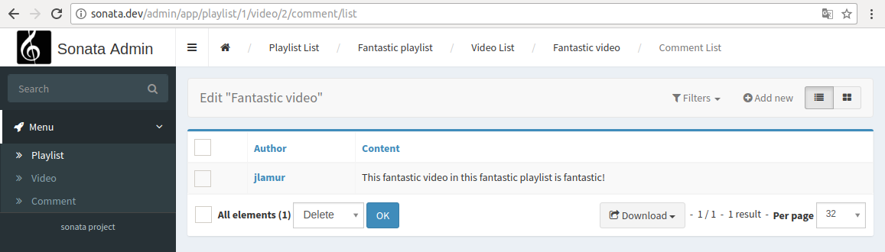

Create child admins
-------------------

.. note::
    This article assumes you are using Symfony 4. Using Symfony 2.8 or 3
    will require to slightly modify some namespaces and paths when creating
    entities and admins.

Let us say you have a ``PlaylistAdmin`` and a ``VideoAdmin``. You can
optionally declare the ``VideoAdmin`` to be a child of the ``PlaylistAdmin``.
This will create new routes like, for example, ``/playlist/{id}/video/list``,
where the videos will automatically be filtered by post.

To do this, you first need to call the ``addChild`` method in your ``PlaylistAdmin``
service configuration with two arguments, the child admin name (in this case
``VideoAdmin`` service) and the Entity field that relates our child Entity with
its parent:

.. configuration-block::

    .. code-block:: yaml

        # app/config/services.yml
        App\Admin\PlaylistAdmin:
            calls:
                - [ addChild, ['@App\Admin\VideoAdmin', 'playlist']]

    .. code-block:: xml

        <!-- app/config/services.xml -->
        <service id="App\Admin\PlaylistAdmin">
            <!-- ... -->

            <call method="addChild">
                <argument type="service" id="App\Admin\PlaylistAdmin" />
                <argument>playlist</argument>
            </call>
        </service>

To display the ``VideoAdmin`` extend the menu in your ``PlaylistAdmin``
class::

    <?php

    namespace App\Admin;

    use Knp\Menu\ItemInterface as MenuItemInterface;
    use Sonata\AdminBundle\Admin\AbstractAdmin;
    use Sonata\AdminBundle\Admin\AdminInterface;

    class PlaylistAdmin extends AbstractAdmin
    {
        // ...

        protected function configureSideMenu(MenuItemInterface $menu, $action, AdminInterface $childAdmin = null)
        {
            if (!$childAdmin && !in_array($action, ['edit', 'show'])) {
                return;
            }

            $admin = $this->isChild() ? $this->getParent() : $this;
            $id = $admin->getRequest()->get('id');

            $menu->addChild('View Playlist', [
                'uri' => $admin->generateUrl('show', ['id' => $id])
            ]);

            if ($this->isGranted('EDIT')) {
                $menu->addChild('Edit Playlist', [
                    'uri' => $admin->generateUrl('edit', ['id' => $id])
                ]);
            }

            if ($this->isGranted('LIST')) {
                $menu->addChild('Manage Videos', [
                    'uri' => $admin->generateUrl('sonata.admin.video.list', ['id' => $id])
                ]);
            }
        }
    }

It also possible to set a dot-separated value, like ``post.author``,
if your parent and child admins are not directly related.

Be wary that being a child admin is optional, which means that regular
routes will be created regardless of whether you actually need them
or not. To get rid of them, you may override the ``configureRoutes`` method::

    <?php

    namespace App\Admin;

    use Sonata\AdminBundle\Admin\AbstractAdmin;
    use Sonata\AdminBundle\Route\RouteCollection;

    class VideoAdmin extends AbstractAdmin
    {
        protected $parentAssociationMapping = 'playlist';

        protected function configureRoutes(RouteCollection $collection)
        {
            if ($this->isChild()) {
                return;
            }

            // This is the route configuration as a parent
            $collection->clear();

        }
    }

You can nest admins as deep as you wish.

Let's say you want to add comments to videos.

You can then add your ``CommentAdmin`` admin service as a child of
the ``VideoAdmin`` admin service.

Finally, the admin interface will look like this:

