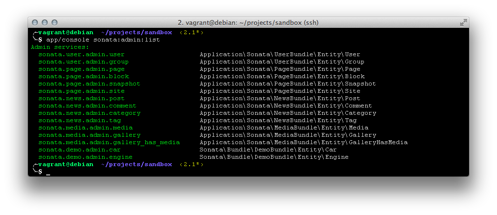
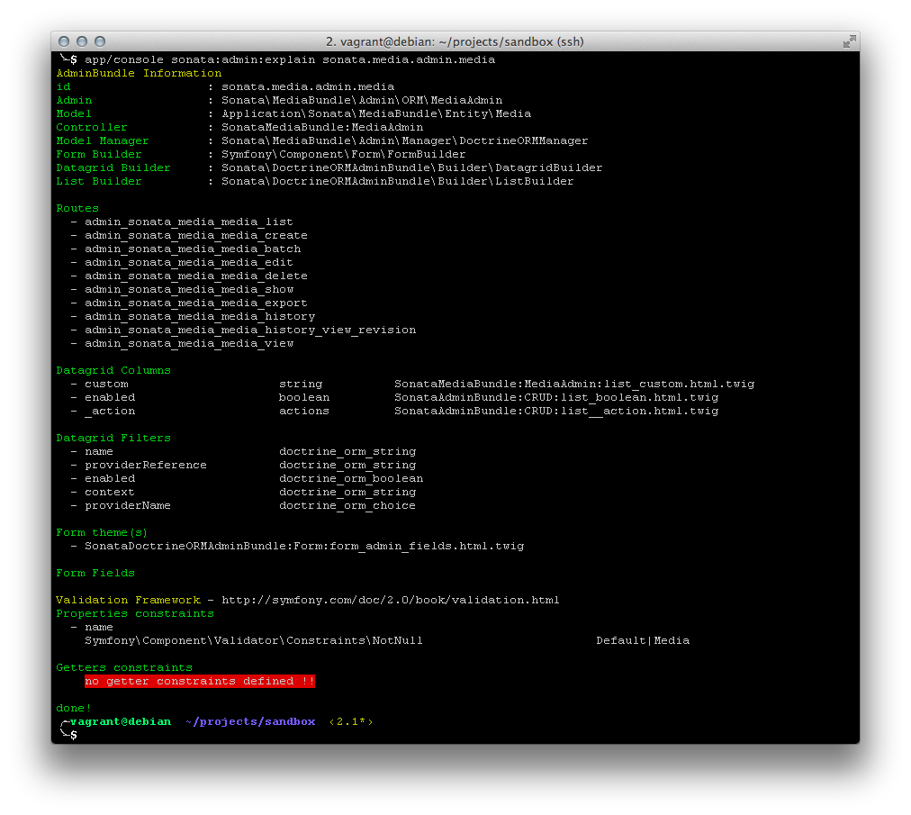

Console/Command-Line Commands
=============================

SonataAdminBundle provides the following console commands:

* ``cache:create-cache-class``
* ``sonata:admin:generate``
* ``sonata:admin:list``
* ``sonata:admin:explain``
* ``sonata:admin:setup-acl``
* ``sonata:admin:generate-object-acl``

cache:create-cache-class
------------------------

The ``cache:create-cache-class`` command generates the cache class
(``app/cache/...env.../classes.php``) from the classes.map file.

Usage example:

.. code-block:: bash

    $ php app/console cache:create-cache-class

sonata:admin:generate
---------------------

The ``sonata:admin:generate`` command generates a new Admin class based on the given model
class, registers it as a service and potentially creates a new controller.
As an argument you need to specify the fully qualified model class.
All passed arguments and options are used as default values in interactive mode.
You can disable the interactive mode with ``--no-interaction`` option.

The command require the SensioGeneratorBundle_ to work. If you don't already have it, you can install it with :

.. code-block:: bash

    $ composer require --dev sensio/generator-bundle

===============   ===============================================================================================================================
Options           Description
===============   ===============================================================================================================================
 **bundle**       the bundle name (the default value is determined by the given model class, e.g. "AppBundle" or "YourNSFooBundle")
 **admin**        the admin class basename (by default this adds "Admin" to the model class name, e.g. "BarAdmin")
 **controller**   the controller class basename (by default this adds "AdminController" to the model class name, e.g. "BarAdminController")
 **manager**      the model manager type (by default this is the first registered model manager type, e.g. "orm")
 **services**     the services YAML file (the default value is "services.yml" or "admin.yml" if it already exist)
 **id**           the admin service ID (the default value is combination of the bundle name and admin class basename like "your_ns_foo.admin.bar")
===============   ===============================================================================================================================

Usage example:

.. code-block:: bash

    $ php app/console sonata:admin:generate AppBundle/Entity/Foo

sonata:admin:list
-----------------

To see which admin services are available use the ``sonata:admin:list`` command.
It prints all the admin service ids available in your application. This command
gets the ids from the ``sonata.admin.pool`` service where all the available admin
services are registered.

Usage example:

.. code-block:: bash

    $ php app/console sonata:admin:list

   List command

sonata:admin:explain
--------------------

The ``sonata:admin:explain`` command prints details about the admin of a model.
As an argument you need to specify the admin service id of the Admin to explain.

Usage example:

.. code-block:: bash

    $ php app/console sonata:admin:explain sonata.news.admin.post

   Explain command

sonata:admin:setup-acl
----------------------

The ``sonata:admin:setup-acl`` command updates ACL definitions for all Admin
classes available in ``sonata.admin.pool``. For instance, every time you create a
new ``Admin`` class, you can create its ACL by using the ``sonata:admin:setup-acl``
command. The ACL database will be automatically updated with the latest masks
and roles.

Usage example:

.. code-block:: bash

    $ php app/console sonata:admin:setup-acl

sonata:admin:generate-object-acl
--------------------------------

The ``sonata:admin:generate-object-acl`` is an interactive command which helps
you to generate ACL entities for the objects handled by your Admins. See the help
of the command for more information.

.. _SensioGeneratorBundle: http://symfony.com/doc/current/bundles/SensioGeneratorBundle/index.html
