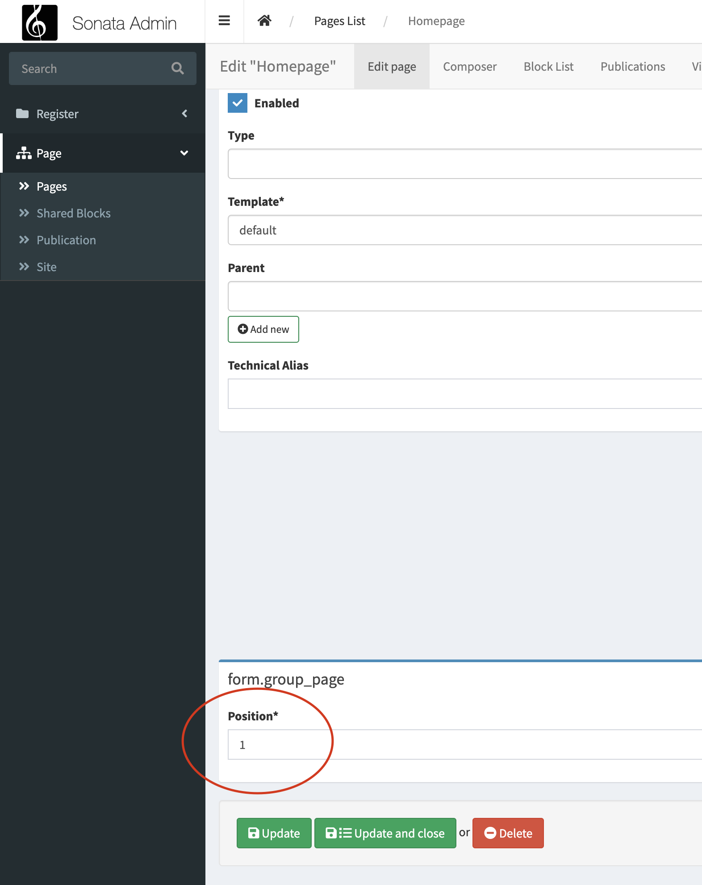

Customize admin
===============

Extension
---------

Admin extensions allow you to add or change features of one or more Admin
instances. To create an extension your class
must implement the interface **Sonata\AdminBundle\Admin\AdminExtensionInterface**
and be registered as a service. The interface defines a number of functions which
you can use to customize the edit form, list view, form validation, alter newly
created objects and other admin features.

.. hint::

    As most of the classes from sonata are **final**, "Extension" is an easy way to customize admins created in sonata's code.

As an example, let's assume that we want to customize ``PageAdmin``, adding ``position`` field into the admin page,
and this admin is declared as ``sonata.page.admin.page``

::

    namespace App\Admin\Extension;

    use Sonata\AdminBundle\Admin\AbstractAdminExtension;
    use Sonata\AdminBundle\Form\FormMapper;
    use Symfony\Component\DependencyInjection\Attribute\AutoconfigureTag;

    #[AutoconfigureTag(name: 'sonata.admin.extension', attributes: ['target' => 'sonata.page.admin.page'])]
    final class PositionAdminExtension extends AbstractAdminExtension
    {
        public function configureFormFields(FormMapper $form): void
        {
            $form->add('position');
        }
    }

As you can see the **position** field was added into the admin page!

.. tip::

    If you want to add the field into the existing group you can check out :ref:`Groups and Tabs`

.. tip::

    If you want to reorder the fields check out `Reorder fields`_

.. note::

    To know more information about how to configure service tags using **yaml**, **xml** or **php** file check out `Symfony Tags docs`_

Attributes supported by ``sonata.admin.extension`` tag
^^^^^^^^^^^^^^^^^^^^^^^^^^^^^^^^^^^^^^^^^^^^^^^^^^^^^^

+------------------------+-------------------------------------------------------------------------------------------------+
| Attribute name         | Description                                                                                     |
+========================+=================================================================================================+
| target                 | Admins service's name that you want to customize,                                               |
|                        | If you use the **global** attribute as **true**, you don't need to pass it.                     |
+------------------------+-------------------------------------------------------------------------------------------------+
| global                 | adds the extension to all admins.                                                               |
+------------------------+-------------------------------------------------------------------------------------------------+
| excludes               | specify one or more admin service ids to which the Extension should not be added                |
|                        | (this will prevent it matching any of the other settings).                                      |
+------------------------+-------------------------------------------------------------------------------------------------+
| extends                | specify one or more classes. If the managed class of an admin extends                           |
|                        | one of the specified classes the extension will be added to that admin.                         |
+------------------------+-------------------------------------------------------------------------------------------------+
| implements             | specify one or more interfaces. If the managed class of an admin implements                     |
|                        | one of the specified interfaces the extension will be added to that admin.                      |
+------------------------+-------------------------------------------------------------------------------------------------+
| instanceof             | specify one or more classes. If the managed class of an admin extends one of the                |
|                        | specified classes or is an instance of that class the extension will be added to that admin.    |
+------------------------+-------------------------------------------------------------------------------------------------+
| uses                   | Specify one or more traits. If the managed class of an admin uses one of the specified traits   |
|                        | the extension will be added to that admin.                                                      |
+------------------------+-------------------------------------------------------------------------------------------------+
| admin_extends          | specify one or more classes. If the class of an admin extends                                   |
|                        | one of the specified classes the extension will be added to that admin.                         |
+------------------------+-------------------------------------------------------------------------------------------------+
| admin_implements       | specify one or more interfaces. If the class of an admin implements                             |
|                        | one of the specified interfaces the extension will be added to that admin.                      |
+------------------------+-------------------------------------------------------------------------------------------------+
| admin_instanceof       | specify one or more classes. If the class of an admin extends one of the                        |
|                        | specified classes or is an instance of that class the extension will be added to that admin.    |
+------------------------+-------------------------------------------------------------------------------------------------+
| admin_uses             | Specify one or more traits. If the class of an admin uses one of the specified traits           |
|                        | the extension will be added to that admin.                                                      |
+------------------------+-------------------------------------------------------------------------------------------------+
| priority               | Can be a positive or negative integer. The higher the priority, the earlier it was executed.    |
+------------------------+-------------------------------------------------------------------------------------------------+

Configuration extension in sonata config
^^^^^^^^^^^^^^^^^^^^^^^^^^^^^^^^^^^^^^^^

It's a another way to configure Admin extension in case you don't want to use services tags,
it's defined in your sonata_admin configs

.. code-block:: yaml

    # config/packages/sonata_admin.yaml

    sonata_admin:
        extensions:
            app.publish.extension:
                admins:
                    - App\Admin\Extension\PositionAdminExtension

+------------------------+-------------------------------------------------------------------------------------------------+
| Attribute name         | Description                                                                                     |
+========================+=================================================================================================+
| global                 | adds the extension to all admins.                                                               |
+------------------------+-------------------------------------------------------------------------------------------------+
| admins                 | specify one or more admin service ids to which the Extension should be added.                   |
+------------------------+-------------------------------------------------------------------------------------------------+
| excludes               | specify one or more admin service ids to which the Extension should not be added                |
|                        | (this will prevent it matching any of the other settings).                                      |
+------------------------+-------------------------------------------------------------------------------------------------+
| extends                | specify one or more classes. If the managed class of an admin extends                           |
|                        | one of the specified classes the extension will be added to that admin.                         |
+------------------------+-------------------------------------------------------------------------------------------------+
| implements             | specify one or more interfaces. If the managed class of an admin implements                     |
|                        | one of the specified interfaces the extension will be added to that admin.                      |
+------------------------+-------------------------------------------------------------------------------------------------+
| instanceof             | specify one or more classes. If the managed class of an admin extends one of the                |
|                        | specified classes or is an instance of that class the extension will be added to that admin.    |
+------------------------+-------------------------------------------------------------------------------------------------+
| uses                   | Specify one or more traits. If the managed class of an admin uses one of the specified traits   |
|                        | the extension will be added to that admin.                                                      |
+------------------------+-------------------------------------------------------------------------------------------------+
| admin_extends          | specify one or more classes. If the class of an admin extends                                   |
|                        | one of the specified classes the extension will be added to that admin.                         |
+------------------------+-------------------------------------------------------------------------------------------------+
| admin_implements       | specify one or more interfaces. If the class of an admin implements                             |
|                        | one of the specified interfaces the extension will be added to that admin.                      |
+------------------------+-------------------------------------------------------------------------------------------------+
| admin_instanceof       | specify one or more classes. If the class of an admin extends one of the                        |
|                        | specified classes or is an instance of that class the extension will be added to that admin.    |
+------------------------+-------------------------------------------------------------------------------------------------+
| admin_uses             | Specify one or more traits. If the class of an admin uses one of the specified traits           |
|                        | the extension will be added to that admin.                                                      |
+------------------------+-------------------------------------------------------------------------------------------------+
| priority               | Can be a positive or negative integer. The higher the priority, the earlier it was executed.    |
+------------------------+-------------------------------------------------------------------------------------------------+

.. code-block:: yaml

    # config/packages/sonata_admin.yaml

    sonata_admin:
        extensions:
            app.publish.extension:
                global: true
                admins:
                    - app.admin.article
                implements:
                    - App\Publish\PublishStatusInterface
                excludes:
                    - app.admin.blog
                    - app.admin.news
                extends:
                    - App\Document\Blog
                instanceof:
                    - App\Document\Page
                uses:
                    - App\Trait\Timestampable
                admin_implements:
                    - App\Admin\PublishableAdminInterface
                admin_extends:
                    - App\Admin\AbstractAdmin
                admin_instanceof:
                    - App\Admin\MediaAdmin
                admin_uses:
                    - App\Trait\Loggable

If those options doesn't fill your need, you can still dynamically add/remove
an extensions in the `AdminInterface::configure()` method of your admin with
the methods `addExtension` and `removeExtension`::

    use App\AdminExtension\PublishStatusAdminExtension;
    use Sonata\AdminBundle\Admin\AbstractAdmin;

    final class PublishStatusAdmin extends AbstractAdmin
    {
        protected function configure(): void
        {
            // ...

            if ($someCondition) {
                $this->addExtension(new PublishStatusAdminExtension());
            }
        }
    }

.. _Reorder fields:

Reorder fields
--------------

Sometime you want to reorder the fields added from Extension.
Methods that pass **Sonata\AdminBundle\Admin\AdminInterface\MapperInterface** or **Sonata\BlockBundle\Form\Mapper\FormMapper** as parameter you can use ``reorder`` method

In case you want to reorder the fields :ref:`Groups and Tabs`, you can do like this:

::

    public function configureFormFields(FormMapper $form): void
    {
        $form
            ->with('main')
                ->reorder([
                    'url',
                    'position'
                ])
                ->add('position')
            ->end()
        ;
    }

In this case the position field will be into the **main** group, after **url** field

.. _Symfony Tags docs: https://symfony.com/doc/current/service_container/tags.html
