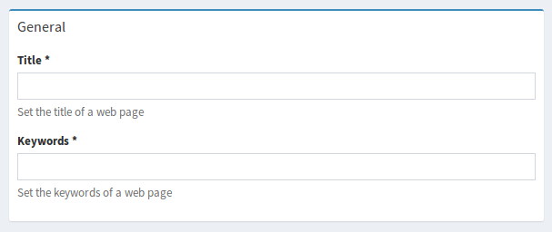

Form Help Messages and Descriptions
===================================

Help Messages
-------------

Help messages are short notes that are rendered together with form fields.
They are generally used to show additional information so the user can complete
the form element faster and more accurately. The text is not escaped,
so HTML can be used.

Example
^^^^^^^

.. code-block:: php

    // src/Admin/PostAdmin.php

    final class PostAdmin extends AbstractAdmin
    {
        protected function configureFormFields(FormMapper $formMapper)
        {
            $formMapper
                ->with('General')
                    ->add('title', null, [
                        'help' => 'Set the title of a web page'
                    ])
                    ->add('keywords', null, [
                        'help' => 'Set the keywords of a web page'
                    ])
                ->end()
            ;
        }
    }

Alternative Ways To Define Help Messages
^^^^^^^^^^^^^^^^^^^^^^^^^^^^^^^^^^^^^^^^

All at once::

    // src/Admin/PostAdmin.php

    final class PostAdmin extends AbstractAdmin
    {
        protected function configureFormFields(FormMapper $formMapper)
        {
            $formMapper
                ->with('General')
                    ->add('title')
                    ->add('keywords')
                    ->setHelps([
                        'title' => 'Set the title of a web page',
                        'keywords' => 'Set the keywords of a web page',
                    ])
                ->end()
            ;
        }
    }

or step by step::

    // src/Admin/PostAdmin.php

    final class PostAdmin extends AbstractAdmin
    {
        protected function configureFormFields(FormMapper $formMapper)
        {
            $formMapper
                ->with('General')
                    ->add('title')
                    ->add('keywords')
                    ->setHelp('title', 'Set the title of a web page')
                    ->setHelp('keywords', 'Set the keywords of a web page')
                ->end()
            ;
        }
    }

This can be very useful if you want to apply general help messages via an ``AdminExtension``.
This Extension for example adds a note field to some entities which use a custom trait::

    namespace App\Admin\Extension;

    use Sonata\AdminBundle\Admin\AbstractAdminExtension;
    use Sonata\AdminBundle\Datagrid\DatagridMapper;
    use Sonata\AdminBundle\Form\FormMapper;
    use Sonata\AdminBundle\Show\ShowMapper;

    final class NoteAdminExtension extends AbstractAdminExtension
    {
        // add this field to the datagrid every time its available
        /**
         * @param DatagridMapper $datagridMapper
         */
        protected function configureDatagridFilters(DatagridMapper $datagridMapper)
        {
            $datagridMapper
                ->add('note')
            ;
        }

        // here we don't add the field, because we would like to define
        // the place manually in the admin. But if the filed is available,
        // we want to add the following help message to the field.
        /**
         * @param FormMapper $formMapper
         */
        protected function configureFormFields(FormMapper $formMapper)
        {
            $formMapper
                ->addHelp('note', 'Use this field for an internal note.')
            ;
        }

        // if the field exists, add it in a special tab on the show view.
        /**
         * @param ShowMapper $showMapper
         */
        protected function configureShowFields(ShowMapper $showMapper)
        {
            $showMapper
                ->with('Internal')
                    ->add('note')
                ->end()
            ;
        }
    }

Advanced usage
^^^^^^^^^^^^^^

Since help messages can contain HTML they can be used for more advanced solutions.
See the cookbook entry :doc:`Showing image previews <../cookbook/recipe_image_previews>` for a detailed example of how to
use help messages to display an image tag.

Form Group Descriptions
-----------------------

A form group description is a block of text rendered below the group title.
These can be used to describe a section of a form. The text is not escaped,
so HTML can be used.

Example
^^^^^^^

.. code-block:: php

    // src/Admin/PostAdmin.php

    final class PostAdmin extends AbstractAdmin
    {
        protected function configureFormFields(FormMapper $formMapper)
        {
            $formMapper
                ->with('General', [
                    'description' => 'This section contains general settings for the web page'
                ])
                    ->add('title', null, [
                        'help' => 'Set the title of a web page'
                    ])
                    ->add('keywords', null, [
                        'help' => 'Set the keywords of a web page'
                    ])
                ->end()
            ;
        }
    }
