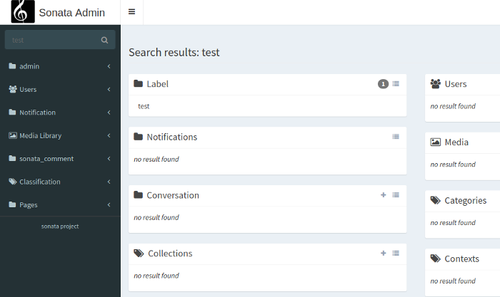
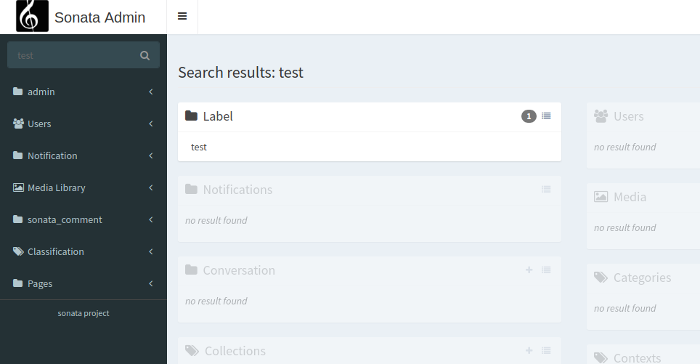

Search
======

The admin comes with a basic global search available in the upper navigation menu. The search iterates over
admin classes and look for filter extending the ``Sonata\AdminBundle\Search\SearchableFilterInterface`` with
the method ``isSearchEnabled`` returning true. If you are using the ``SonataDoctrineORMBundle``, the
``Sonata\DoctrineORMAdminBundle\Filter\StringFilter`` is searchable and rely on a ``global_search`` option.

Disabling the search by admin
-----------------------------

You can disable the search for a whole admin by setting the ``global_search`` attribute
to ``false`` at your admin definition using the tag ``sonata.admin``.

.. configuration-block::

    .. code-block:: xml

        <service id="app.admin.post" class="App\Admin\PostAdmin">
            <tag name="sonata.admin" global_search="false" manager_type="orm" group="Content" label="Post"/>
            <argument/>
            <argument>App\Entity\Post</argument>
            <argument/>
        </service>

Customization
-------------

The main action is using the template ``@SonataAdmin/Core/search.html.twig``. And each search is handled by a
``block``, the template for the block is ``@SonataAdmin/Block/block_search_result.html.twig``.

The default template values can be configured in the configuration section

.. configuration-block::

    .. code-block:: yaml

        # config/packages/sonata_admin.yaml

        sonata_admin:
            templates:
                # other configuration options
                search:              '@SonataAdmin/Core/search.html.twig'
                search_result_block: '@SonataAdmin/Block/block_search_result.html.twig'

You also need to configure the block in the sonata block config

.. configuration-block::

    .. code-block:: yaml

        # config/packages/sonata_admin.yaml

        sonata_block:
            blocks:
                sonata.admin.block.search_result:
                    contexts: [admin]

You can also configure the block template per admin while defining the admin:

.. configuration-block::

    .. code-block:: xml

        <service id="app.admin.post" class="App\Admin\PostAdmin">
              <tag name="sonata.admin" manager_type="orm" group="Content" label="Post"/>
              <argument/>
              <argument>App\Entity\Post</argument>
              <argument/>
              <call method="setTemplate">
                  <argument>search_result_block</argument>
                  <argument>@SonataPost/Block/block_search_result.html.twig</argument>
              </call>
          </service>

Configure the default search result action
^^^^^^^^^^^^^^^^^^^^^^^^^^^^^^^^^^^^^^^^^^

In general the search result generates a link to the edit action of an item or is using the show action, if the edit
route is disabled or you haven't the required permission. You can change this behavior by overriding the
``searchResultActions`` property. The defined action list will we checked successive until a route with the required
permissions exists. If no route is found, the item will be displayed as a text::

    // src/Admin/PersonAdmin.php

    final class PersonAdmin extends AbstractAdmin
    {
        protected $searchResultActions = ['edit', 'show'];
    }

Performance
-----------

The current implementation can be expensive if you have a lot of entities as the resulting query does a ``LIKE %query% OR LIKE %query%``...

.. note::

    There is a work in progress to use an async JavaScript solution to better load data from the database.

Customize visibility of empty result boxes
------------------------------------------

By default all the admin boxes are shown in search results and it looks like this:

We can fade out the boxes that have no results with:

.. code-block:: yaml

    # config/packages/sonata_admin.yaml

    sonata_admin:
        global_search:
            empty_boxes: fade

and it looks like this:

The third option is to hide the empty boxes:

.. code-block:: yaml

    # config/packages/sonata_admin.yaml

    sonata_admin:
        global_search:
            empty_boxes: hide

and it looks like this:

.. figure:: ../images/empty_boxes_hide.png
    :align: center
    :alt: Custom view
    :width: 700px
